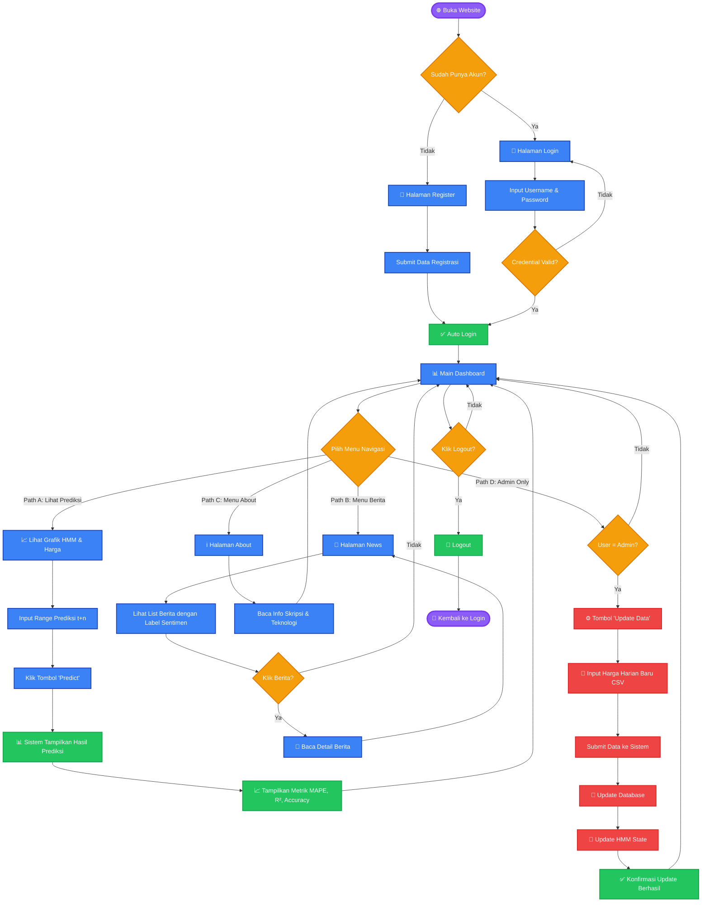

# User Flowchart - CPO Price Prediction System

## Mermaid.js Activity Diagram

## 📋 Penjelasan Alur

### **Aktor:**
1. **User (Pengguna Umum):** Dapat mengakses Dashboard, News, dan About
2. **Admin:** Memiliki semua akses User + fitur Update Data

---

### **Alur Utama:**

#### 🔐 **1. Authentication Flow**
- **Start:** User membuka website
- **Decision 1:** Sudah punya akun?
  - **Tidak:** Ke halaman Register → Submit data → Auto login
  - **Ya:** Ke halaman Login → Input credentials → Validasi → Dashboard

#### 📊 **2. Main Dashboard**
Setelah login berhasil, user masuk ke Dashboard utama dengan 4 pilihan navigasi:

---

#### **Path A: Lihat Prediksi (Prediction View)** 📈
1. User melihat grafik HMM dan harga historis
2. Input range prediksi (misalnya: t+7 untuk 7 hari ke depan)
3. Klik tombol **"Predict"**
4. Sistem menampilkan:
   - Hasil prediksi harga
   - Metrik evaluasi (MAPE, R², Accuracy)
   - Grafik dengan overlay HMM state (Bullish/Bearish/Neutral)
5. Kembali ke Dashboard

---

#### **Path B: Menu Berita (News)** 📰
1. User klik menu **"News"**
2. Melihat list berita dengan:
   - Label sentimen (🟢 Positive, 🔴 Negative, ⚪ Neutral)
   - Skor sentimen dari FinBERT
3. **Decision:** Klik berita untuk detail?
   - **Ya:** Baca artikel lengkap
   - **Tidak:** Kembali ke Dashboard
4. Return ke Dashboard

---

#### **Path C: Menu About** ℹ️
1. User klik menu **"About"**
2. Membaca informasi:
   - Tujuan skripsi
   - Teknologi yang digunakan
   - Metodologi (HMM, FinBERT)
3. Kembali ke Dashboard

---

#### **Path D: Admin Only (Update Data)** ⚙️
1. User klik tombol **"Update Data"**
2. **Decision:** Apakah user = Admin?
   - **Tidak:** Kembali ke Dashboard (access denied)
   - **Ya:** Lanjut ke Admin Panel
3. Admin input file CSV harga harian baru (format Indonesia)
4. Submit data ke sistem
5. Sistem melakukan:
   - **Update Database** dengan data baru
   - **Update HMM State** (recalculate market regime)
6. Konfirmasi update berhasil ✅
7. Kembali ke Dashboard

---

#### 🚪 **3. Logout Flow**
- **Decision:** User klik logout?
  - **Ya:** Proses logout → Kembali ke halaman Login
  - **Tidak:** Tetap di Dashboard

---

## 🎨 **Color Legend:**

- 🟦 **Blue (Process):** Proses normal (form, display)
- 🟧 **Orange (Decision):** Keputusan/pilihan user
- 🟥 **Red (Admin):** Proses khusus Admin
- 🟩 **Green (Success):** Aksi berhasil/konfirmasi
- 🟪 **Purple (Start/End):** Titik awal dan akhir

---

## 📝 **Notes:**

1. **HMM State Overlay:**
   - Background chart berubah warna sesuai market state
   - 🟢 **Green:** Bullish (State = 1)
   - 🔴 **Red:** Bearish (State = 0)
   - ⚪ **Gray:** Neutral (State = 2)

2. **Sentiment Labels (FinBERT):**
   - Otomatis dianalisis saat berita ditambahkan
   - Score range: -1 (Very Negative) to +1 (Very Positive)

3. **CSV Import (Admin):**
   - Support format Indonesia (3.500,00)
   - Auto-parsing tanggal (DD.MM.YYYY)
   - Header: Tanggal, Terakhir, Pembukaan, Tertinggi, Terendah, Vol.

4. **Prediction Range:**
   - User dapat memilih t+1 sampai t+30 hari
   - Sistem menampilkan confidence interval

---

## 🔗 **Use Cases:**

### **User Biasa:**
- ✅ Login/Register
- ✅ Lihat prediksi harga
- ✅ Baca berita dengan sentimen
- ✅ Baca info about
- ❌ Update data (no access)

### **Admin:**
- ✅ Semua akses User
- ✅ Upload CSV data harga baru
- ✅ Update HMM state
- ✅ Manage data via Django Admin

---

**Created:** December 17, 2025  
**Format:** Mermaid.js Flowchart  
**Type:** Activity Diagram (User Flow)
