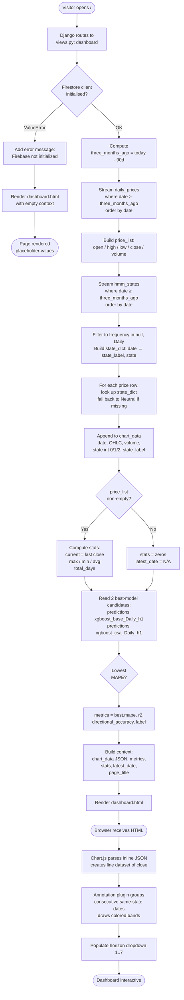
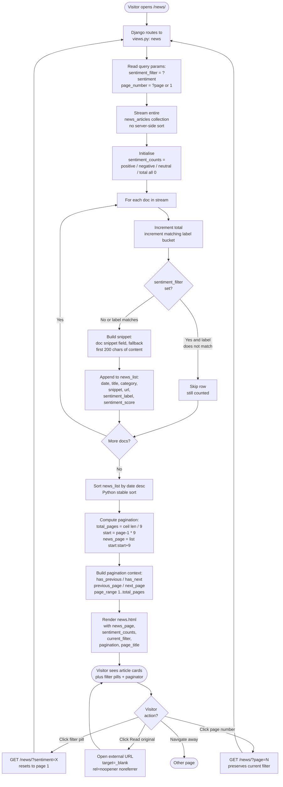

```mermaid
flowchart TD
    A([Visitor on Dashboard]) --> B[Visitor selects horizon N<br/>1–7 days ahead]
    B --> C[Visitor clicks<br/>Get Prediction button]

    C --> D[run-prediction click handler]
    D --> D1[Hide previous result + error<br/>Show loading spinner]

    D1 --> E[Build request fan-out:<br/>for h in 1..N<br/>for v in base, csa<br/>fetchOne model, v, h]

    E --> F[Promise.all<br/>2 × N parallel GET requests<br/>to /api/prediction/]

    F --> G[Each request hits<br/>views.py: prediction_api]
    G --> G1[Validate model / variant /<br/>frequency / horizon]
    G1 --> G2{Valid<br/>params?}
    G2 -->|No| G3[Return JSON<br/>error 400]
    G2 -->|Yes| G4[Build doc_id:<br/>xgboost_v_Daily_hN]
    G4 --> G5[predictions.document doc_id .get]
    G5 --> G6{Doc exists?}
    G6 -->|No| G7[Return JSON<br/>404 error]
    G6 -->|Yes| G8[Return JSON<br/>predicted_date, predicted_price,<br/>last_actual_*, metrics]

    G3 --> H[fetchOne returns null<br/>treated as missing]
    G7 --> H
    G8 --> I[fetchOne returns parsed result]

    H --> J
    I --> J[All Promises resolved<br/>group results by horizon]

    J --> K[Hide loading spinner]
    K --> L[For each h in 1..N:<br/>pickBest of 2 candidates<br/>by lowest MAPE]

    L --> L1{Any<br/>picks?}
    L1 -->|No| L2[Show error<br/>Predictions unavailable]
    L2 --> L3[Clear prediction datasets]
    L3 --> END1([Visitor sees error message])

    L1 -->|Yes| M[Take last_actual_* from any result<br/>same across all horizons]

    M --> N[Update result panel:<br/>Last Actual row +<br/>one row per horizon<br/>swatch + Nd + variant + price + MAPE]

    N --> O[plotPredictions:<br/>extend chart labels with new dates<br/>sort chronologically]
    O --> O1[Remove any prior<br/>prediction datasets]
    O1 --> O2[For each pick:<br/>add 2-point dotted dataset<br/>last actual → predicted<br/>color = HORIZON_COLORS h]

    O2 --> O3[Show prediction legend chip]
    O3 --> P[priceChart.update]
    P --> Q([Chart fans out N colored<br/>prediction lines])
```

# Activity Diagrams — CPO Prediction Website

> Scope: the public-facing Django website (`website/`).
> Reflects state as of 2026-05-05 — post auth-removal and post
> multi-horizon prediction feature.
> The daily Cloud Run scheduler that populates Firestore is out of
> scope here; see [ARCHITECTURE.md](../ARCHITECTURE.md) for that flow.

Three activity flows are documented:

1. [Dashboard Load](#1-dashboard-load)
2. [Multi-Horizon Prediction Request](#2-multi-horizon-prediction-request)
3. [News Browsing & Filtering](#3-news-browsing--filtering)

---

## 1. Dashboard Load

### Diagram

### Activity Descriptions

| Step | Actor | Description |
|---|---|---|
| Routes to dashboard | Django | URL `/` resolves to `views.py:dashboard` (no auth decorator). |
| Firestore client init | System | `firestore.client()`; raises `ValueError` if `firebase_admin.initialize_app` was not called. |
| three_months_ago | System | `(datetime.now().date() - timedelta(days=90)).isoformat()` — sliding 90-day window. |
| Stream daily_prices | System | `.where('date','>=',cutoff).order_by('date').stream()` — single-field filter so no composite index needed. |
| Stream hmm_states | System | Same query shape; filter `frequency in (None, 'Daily')` is applied client-side. |
| Build chart_data | System | Per-row merge of price + HMM label; `state_label` mapped via `{Bearish:0, Bullish:1, Neutral:2}`. |
| Compute stats | System | List-comprehension `max() / min() / sum()/len()` on `close` values. |
| Best-model lookup | System | Iterates over `('base','csa')` for `xgboost_*_Daily_h1`; picks lowest MAPE. |
| Render dashboard.html | System | `django.shortcuts.render` with the assembled context dict. |
| Chart.js init | Browser | Parses `{{ chart_data\|safe }}` into JS array; constructs a single `'Close Price'` dataset. |
| Annotation bands | Browser | Walks `chart_data`; emits one `box` annotation per consecutive run of same `state`. |
| Populate horizon dropdown | Browser | Static array `[1..7]` → `<option>` per horizon (variant select was removed). |

**Key files:** `website/web/views.py:dashboard`, `website/web/templates/dashboard.html`, `website/web/templates/base.html`

---

## 2. Multi-Horizon Prediction Request

### Diagram

### Activity Descriptions

| Step | Actor | Description |
|---|---|---|
| Visitor picks horizon N | Visitor | Single dropdown — variant is auto-picked per horizon, no longer user-selectable. |
| Build request fan-out | Browser JS | Nested loop produces `2 × N` `Promise`s before awaiting; max 14 calls (h=7). |
| `Promise.all` | Browser JS | All requests fire concurrently; total wall time ≈ slowest single request. |
| `fetchOne` | Browser JS | On any non-2xx response, body error, or thrown exception → returns `null`; per-horizon picker tolerates one missing variant. |
| Validate params | Django | Hard-coded sets: `model in {xgboost}`, `variant in {base,csa}`, `frequency in {Daily}`, `horizon` parsed as int. |
| Build doc_id | Django | `f'xgboost_{variant}_Daily_h{horizon}'` — deterministic, no Firestore composite index needed. |
| Return JSON | Django | `JsonResponse` with HTTP 200 (success), 400 (bad params), 404 (no doc), or 500 (server error). |
| Group by horizon | Browser JS | `byHorizon[r.horizon] = byHorizon[r.horizon] || []; ...push(r)` — nulls dropped. |
| `pickBest` | Browser JS | Filters out `null`s and missing `metrics.mape`; sorts ascending by MAPE; returns index 0. |
| Update result panel | Browser JS | One row per horizon containing color swatch (matches chart), `+Nd`, variant tag, `Rp …`, MAPE %. |
| `plotPredictions` | Browser JS | Extends `labels` with all new prediction dates, sorts chronologically, rebuilds the close-price dataset on the new label set, then appends one dataset per pick. |
| `HORIZON_COLORS` | Browser JS | `{1:amber, 2:pink, 3:violet, 4:cyan, 5:emerald, 6:indigo, 7:lime}` — fixed palette. |

**Key files:** `website/web/templates/dashboard.html` (`run-prediction` click handler, `fetchOne`, `pickBest`, `plotPredictions`); `website/web/views.py:prediction_api`.

---

## 3. News Browsing & Filtering

### Diagram

### Activity Descriptions

| Step | Actor | Description |
|---|---|---|
| Read query params | Django | `request.GET.get('sentiment')`, `int(request.GET.get('page', 1))`. No validation on `page` overflow — handled implicitly by slicing. |
| Stream collection | Django | `.collection('news_articles').stream()` — full scan; sort done client-side to avoid composite index. |
| sentiment_counts | Django | Counted before filter — visitor always sees the global breakdown, not the post-filter slice. |
| Skip on filter mismatch | Django | Filter compares raw `sentiment_label` strings (`'Positive'` / `'Negative'` / `'Neutral'`). |
| Snippet fallback | Django | Uses pre-computed `snippet` field from scheduler; if absent, derives from first 200 chars of `content` clipped at last space. |
| Sort by date desc | Django | Python `list.sort(key=…, reverse=True)` — strings sort lexicographically; valid because dates are `YYYY-MM-DD`. |
| Pagination | Django | Hard-coded `items_per_page = 9`; `page_range = range(1, total_pages+1)` for the UI. |
| Filter pill click | Browser | Plain `<a>` links — full page reload, no AJAX. |
| Page number click | Browser | `?page=N&sentiment=X` — current filter preserved as a second query param. |
| Read original | Browser | External URL in a new tab; site does not proxy article content. |

**Key files:** `website/web/views.py:news`, `website/web/templates/news.html`
