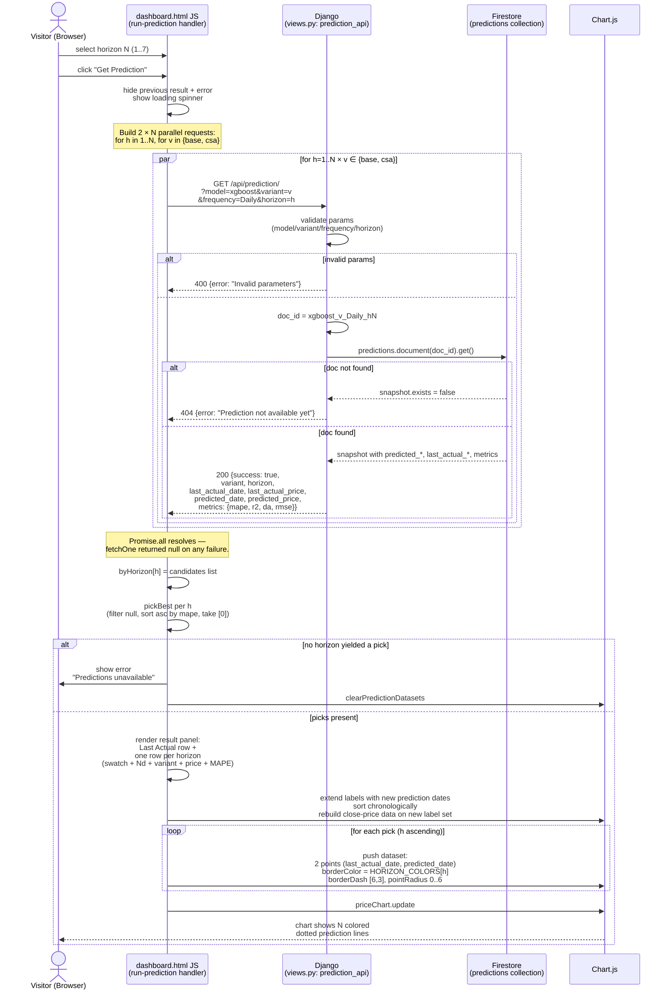
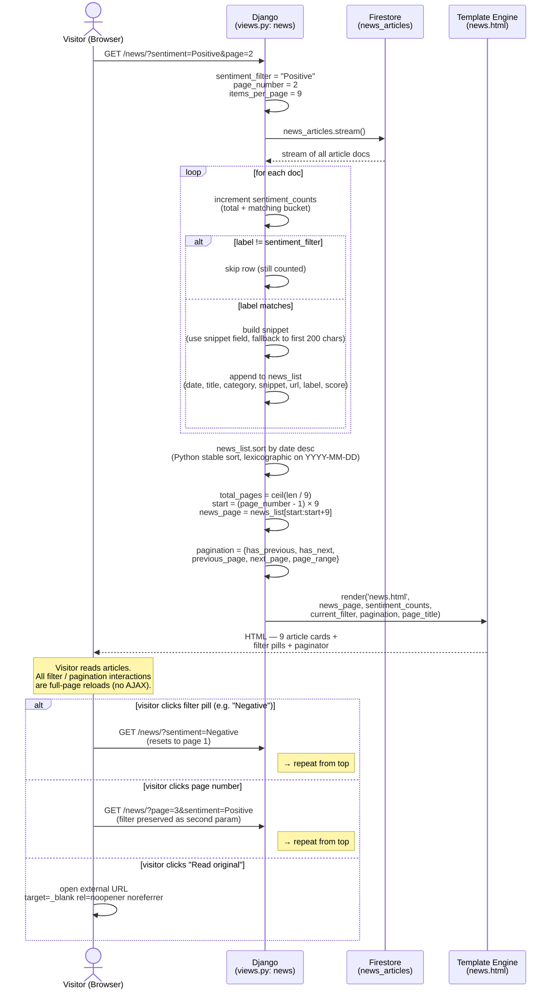

# Sequence Diagrams — CPO Prediction Website

> Scope: the public-facing Django website (`website/`).
> Reflects state as of 2026-05-05 — post auth-removal and post
> multi-horizon prediction feature.
> The daily Cloud Run scheduler that populates Firestore is out of
> scope here; see [ARCHITECTURE.md](../ARCHITECTURE.md) for that flow.

Three interaction flows are documented:

1. [Dashboard Initial Load](#1-dashboard-initial-load)
2. [Multi-Horizon Prediction (fan-out)](#2-multi-horizon-prediction-fan-out)
3. [News Page with Sentiment Filter](#3-news-page-with-sentiment-filter)

---

## 1. Dashboard Initial Load

### Diagram

```mermaid
sequenceDiagram
    actor V as Visitor (Browser)
    participant DJ as Django<br/>(views.py: dashboard)
    participant FS as Firestore
    participant TM as Template Engine<br/>(dashboard.html)
    participant JS as Chart.js + Annotation Plugin

    V->>DJ: GET /

    DJ->>DJ: cutoff = today − 90 days

    DJ->>FS: daily_prices<br/>where date ≥ cutoff<br/>order_by date
    FS-->>DJ: stream of price docs<br/>(open / high / low / close / volume)

    DJ->>FS: hmm_states<br/>where date ≥ cutoff<br/>order_by date
    FS-->>DJ: stream of state docs<br/>(state_label, state, frequency)

    DJ->>DJ: filter to frequency in null, Daily<br/>build state_dict by date

    DJ->>DJ: zip price rows with HMM labels<br/>map label → 0/1/2 for color coding<br/>build chart_data list

    DJ->>DJ: compute stats:<br/>current / max / min / avg / total_days

    DJ->>FS: predictions.document<br/>xgboost_base_Daily_h1 .get
    FS-->>DJ: doc snapshot
    DJ->>FS: predictions.document<br/>xgboost_csa_Daily_h1 .get
    FS-->>DJ: doc snapshot

    DJ->>DJ: pick lowest-MAPE candidate<br/>build metrics dict

    DJ->>TM: render(dashboard.html,<br/>chart_data JSON, metrics, stats,<br/>latest_date, page_title)
    TM-->>V: HTML with inline JSON<br/>+ horizon select 1..7

    V->>JS: Chart.js parses chart_data
    JS->>JS: build close-price dataset<br/>walk states; emit annotation boxes<br/>green/red/gray per state
    JS-->>V: rendered chart with bands

    Note over V,JS: Dashboard interactive.<br/>Visitor may now select a horizon<br/>and click "Get Prediction" → flow #2.
```

### Message Descriptions

| # | From | To | Message | Description |
|---|---|---|---|---|
| 1 | Visitor | Django | `GET /` | Plain HTTP request; no cookies required. |
| 2 | Django | Firestore | `daily_prices.where('date','>=',cutoff).order_by('date')` | Single-field filter — no composite index needed. |
| 3 | Django | Firestore | `hmm_states.where('date','>=',cutoff).order_by('date')` | Same shape as #2; `frequency` filter is applied client-side. |
| 4 | Django | Django | `state_dict[date] = {state_label, state}` | Skips docs whose `frequency` is set and not `'Daily'`. |
| 5 | Django | Django | `chart_data.append(...)` | Per-row merge of price + HMM; defaults to Neutral if no state on that date. |
| 6 | Django | Django | `stats = {...}` | Plain Python `max() / min() / sum()/len()`. |
| 7 | Django | Firestore | `predictions.document('xgboost_{base,csa}_Daily_h1').get()` | Two single-doc reads (one per variant). |
| 8 | Django | Django | `metrics` | Picks lowest `mape`, formats as `{mape, r2, accuracy, best_model}`. |
| 9 | Django | Template | `render('dashboard.html', context)` | Django renders with `{{ chart_data\|safe }}` injected as inline JSON. |
| 10 | Template | Visitor | HTML + JSON | Single response; no further server-side calls during load. |
| 11 | Visitor | Chart.js | `JSON.parse(chartData)` | Inline JSON parsed in `<script>` block. |
| 12 | Chart.js | Chart.js | annotation boxes | Walks `chart_data`; for each consecutive run of same `state`, emits one `box` annotation between `xMin` and `xMax` with `stateColors[curState]`. |

**Key files:** `website/web/views.py:dashboard`, `website/web/templates/dashboard.html`, `website/web/templates/base.html`

---

## 2. Multi-Horizon Prediction (fan-out)

### Diagram



### Message Descriptions

| # | From | To | Message | Description |
|---|---|---|---|---|
| 1 | Visitor | JS | select horizon + click | Single dropdown — variant is auto-picked per horizon. |
| 2 | JS | JS | `loadingEl.classList.remove('hidden')` | UI feedback before fan-out. |
| 3 | JS | Django | `GET /api/prediction/?model=xgboost&variant={base,csa}&frequency=Daily&horizon=h` | One request per `(variant, h)`; up to 14 concurrent requests for `h=7`. |
| 4 | Django | Django | param validation | Rejects unsupported model/variant/frequency or non-int horizon with HTTP 400. |
| 5 | Django | Firestore | `predictions.document(doc_id).get()` | Single-doc read; `doc_id = f'xgboost_{variant}_Daily_h{horizon}'`. |
| 6 | Firestore | Django | `DocumentSnapshot` | `.exists = false` if the scheduler has not yet written this doc. |
| 7 | Django | JS | `JsonResponse({...})` | HTTP 200 on success with all prediction fields; HTTP 404 if missing. |
| 8 | JS | JS | `fetchOne` returns `null` on any non-2xx, body error, or thrown exception | Per-horizon picker tolerates one missing variant; both missing → that horizon is skipped. |
| 9 | JS | JS | `pickBest(candidates)` | Lowest `metrics.mape` wins. Picks across `{base, csa}` independently per horizon — results may be mixed (e.g. CSA-h1, Base-h2, CSA-h3). |
| 10 | JS | JS | result panel render | Rows include a colored swatch matching the chart line so the legend is visually obvious. |
| 11 | JS | Chart.js | `data.labels` extension + dataset push | One dataset per horizon, each a 2-point dotted line from the last actual close to that horizon's predicted price. |
| 12 | JS | Chart.js | `priceChart.update()` | Single re-render after all datasets are queued. |

**Color palette (per horizon):**
| h | Color | Hex |
|---|-------|-----|
| 1 | amber | `#f59e0b` |
| 2 | pink | `#ec4899` |
| 3 | violet | `#8b5cf6` |
| 4 | cyan | `#06b6d4` |
| 5 | emerald | `#10b981` |
| 6 | indigo | `#6366f1` |
| 7 | lime | `#84cc16` |

**Key files:** `website/web/templates/dashboard.html` (`run-prediction` click handler, `fetchOne`, `pickBest`, `plotPredictions`); `website/web/views.py:prediction_api`.

---

## 3. News Page with Sentiment Filter

### Diagram



### Message Descriptions

| # | From | To | Message | Description |
|---|---|---|---|---|
| 1 | Visitor | Django | `GET /news/?sentiment=…&page=…` | Both query params optional; defaults are no-filter and page 1. |
| 2 | Django | Firestore | `.collection('news_articles').stream()` | Full scan — sort and filter happen in Python to avoid a Firestore composite index. |
| 3 | Django | Django | `sentiment_counts` | Always counts the global pre-filter totals so the visitor sees the breakdown of the whole dataset, not the filtered slice. |
| 4 | Django | Django | snippet fallback | Uses scheduler-precomputed `snippet`; if missing, derives from `content[:200]` clipped at last space + ellipsis. |
| 5 | Django | Django | `news_list.sort(key=…, reverse=True)` | `YYYY-MM-DD` sorts correctly as strings; no `datetime.parse()` needed. |
| 6 | Django | Django | pagination | `page_range = range(1, total_pages+1)` — passed straight to the template for "1, 2, 3 …" chips. |
| 7 | Django | Template | `render('news.html', context)` | Tailwind grid: `grid-cols-1 md:grid-cols-2 lg:grid-cols-3` for the article cards. |
| 8 | Template | Visitor | HTML | Pagination URLs preserve the active filter in every link to avoid losing state. |
| 9 | Visitor | Django | filter or page click | Plain `<a>` link → full page reload; SEO-friendly URLs. |
| 10 | Visitor | external | "Read original" | Opens MPOB / source URL in a new tab; the website never proxies article bodies. |

**Key files:** `website/web/views.py:news`, `website/web/templates/news.html`
