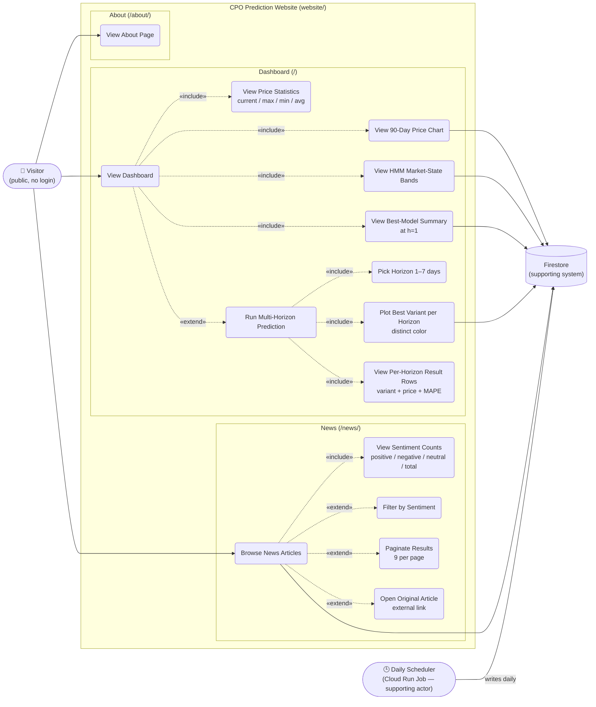

# Use Case Diagram — CPO Prediction Website

> Scope: the public-facing Django website (`website/`).
> Reflects state as of 2026-05-05 — post auth-removal and post
> multi-horizon prediction feature.
> The daily Cloud Run scheduler that populates Firestore is shown only
> as a supporting actor; for its internal use cases see
> [ARCHITECTURE.md](../ARCHITECTURE.md) (`scheduler/` module).

## Diagram

---

## Actors

### Visitor (primary)
The sole human actor. Anyone who opens the site in a browser.

| Attribute | Detail |
|---|---|
| Authentication | None — public-facing read-only site |
| Access scope | All routes: `/`, `/news/`, `/about/`, `/api/prediction/` |
| State held | None on the server (no server-side session for user data) |
| Implementation | No `@login_required` decorators; no `request.user.is_authenticated` checks |

### Daily Scheduler (supporting, non-human)
The Cloud Run Job (`scheduler/main.py`) that refreshes Firestore once per day. The website does **not** call it — it only reads what the scheduler has written.

| Attribute | Detail |
|---|---|
| Trigger | Cloud Scheduler cron (daily, 1 AM MYT) |
| Writes to | `daily_prices`, `hmm_states`, `news_articles`, `sentiment_aggregates`, `predictions` |
| Visibility from website | None directly — coupled only via Firestore |

### Firestore (supporting system)
Google Cloud Firestore. Source of truth for everything the website reads.

| Collection            | Used by website at  |
|-----------------------|---------------------|
| `daily_prices`        | Dashboard chart, statistics |
| `hmm_states`          | Dashboard state bands |
| `predictions`         | Best-model card, multi-horizon prediction |
| `news_articles`       | News page |

---

## Use Case Descriptions

### Dashboard (`/`)

#### UC1 — View Dashboard
- **Actor:** Visitor
- **Trigger:** Visitor navigates to `/`
- **Flow:**
  1. Django view `dashboard()` initialises a Firestore client.
  2. Reads last 90 days from `daily_prices`, the matching `hmm_states`, and the best `xgboost_*_Daily_h1` prediction.
  3. Serialises chart data to JSON and renders `dashboard.html`.
  4. Browser draws the chart (Chart.js + annotation plugin).
- **Includes:** UC2, UC3, UC4, UC5
- **Extends:** UC6 (only when the visitor clicks "Get Prediction")
- **Implementation:** `website/web/views.py:dashboard`, `website/web/templates/dashboard.html`

#### UC2 — View 90-Day Price Chart
- **Actor:** Visitor (via UC1)
- **Flow:** Chart.js draws a single line dataset of close prices over the 90-day window; tooltip exposes O/H/L/C and the date's HMM label.
- **Implementation:** `dashboard.html` JavaScript; data from `daily_prices` collection.

#### UC3 — View HMM Market-State Bands
- **Actor:** Visitor (via UC1)
- **Flow:** Consecutive same-state dates are grouped and drawn as background rectangles using `chartjs-plugin-annotation`. Color map: Bullish → green, Bearish → red, Neutral → gray.
- **Implementation:** `dashboard.html` (JS `annotations` block); data from `hmm_states` collection.

#### UC4 — View Price Statistics
- **Actor:** Visitor (via UC1)
- **Flow:** Sidebar card shows `current_price`, `max_price`, `min_price`, `avg_price` over the same 90-day window — computed in Python.
- **Implementation:** `views.py:dashboard` stats block.

#### UC5 — View Best-Model Summary (h=1)
- **Actor:** Visitor (via UC1)
- **Flow:** Among `xgboost_{base,csa}_Daily_h1` documents, the one with the lowest MAPE is shown in the top metric strip with MAPE / R² / Directional Accuracy.
- **Implementation:** `views.py:dashboard` "best metric" loop.

#### UC6 — Run Multi-Horizon Prediction
- **Actor:** Visitor
- **Trigger:** Visitor selects a horizon `N` (1–7) and clicks **Get Prediction**.
- **Precondition:** `xgboost_{base,csa}_Daily_h{1..N}` exist in Firestore.
- **Flow:**
  1. Browser fans out **2 × N** parallel `GET /api/prediction/` calls (one per `(variant, h)` for `h=1..N`).
  2. For each `h`, picks the variant with the lowest MAPE.
  3. Adds one Chart.js dataset per `h` — a 2-point dotted line from the last actual close to that horizon's predicted price, in a horizon-distinct color.
  4. Updates the result panel with one row per horizon: color swatch, `+Nd`, chosen variant, predicted price, MAPE.
- **Includes:** UC7, UC8, UC9
- **Implementation:** `dashboard.html` (`run-prediction` click handler, `fetchOne`, `pickBest`, `plotPredictions`); backend endpoint `views.py:prediction_api`.

#### UC7 — Pick Horizon (1–7 days)
- **Actor:** Visitor (via UC6)
- **Flow:** Single `<select>` populated with `1 day ahead … 7 days ahead`. The Variant dropdown was removed — best variant is auto-picked per horizon.

#### UC8 — Plot Best Variant per Horizon (distinct color)
- **Actor:** Visitor (via UC6)
- **Flow:** Color palette is fixed: h1 amber, h2 pink, h3 violet, h4 cyan, h5 emerald, h6 indigo, h7 lime. Each horizon's prediction is its own dataset so the legend / hover key is per-horizon.

#### UC9 — View Per-Horizon Result Rows
- **Actor:** Visitor (via UC6)
- **Flow:** For each horizon `h ≤ N`, one row shows a colored swatch matching the chart line, `+Nd`, `(CSA)` or `(Base)` badge, predicted price (Rp), and MAPE.

---

### News (`/news/`)

#### UC10 — Browse News Articles
- **Actor:** Visitor
- **Trigger:** Visitor navigates to `/news/`.
- **Flow:**
  1. View streams the entire `news_articles` collection (sort happens in Python — avoids a Firestore composite index).
  2. Articles are sorted by `date` descending and chunked at 9 per page.
  3. Each card shows: category, date, sentiment badge (Positive / Negative / Neutral), title, snippet, link to the original article.
- **Includes:** UC11
- **Extends:** UC12, UC13, UC14
- **Implementation:** `website/web/views.py:news`, `website/web/templates/news.html`

#### UC11 — View Sentiment Counts
- **Actor:** Visitor (via UC10)
- **Flow:** Top-of-page strip totals the four counts (positive / negative / neutral / total) over the entire collection — counts are computed before any filter is applied.

#### UC12 — Filter by Sentiment
- **Actor:** Visitor
- **Trigger:** Visitor clicks one of the four pill buttons (All / Positive / Negative / Neutral).
- **Flow:** Filter is passed as `?sentiment=Positive` (etc.) on the URL. The view excludes rows whose `sentiment_label` does not match before paginating.

#### UC13 — Paginate Results
- **Actor:** Visitor
- **Trigger:** Visitor clicks `<`, `>`, or a page number.
- **Flow:** `?page=N` on the URL. The current sentiment filter is preserved on every pagination link.

#### UC14 — Open Original Article
- **Actor:** Visitor
- **Flow:** "Read original →" opens the source URL in a new tab (`target="_blank" rel="noopener noreferrer"`). The website does not proxy or cache the article body itself.

---

### About (`/about/`)

#### UC15 — View About Page
- **Actor:** Visitor
- **Trigger:** Visitor navigates to `/about/`.
- **Flow:** Static template render — describes scope, data sources, and the daily-scheduler pipeline at a high level. No Firestore reads.
- **Implementation:** `website/web/views.py:about`, `website/web/templates/about.html`
