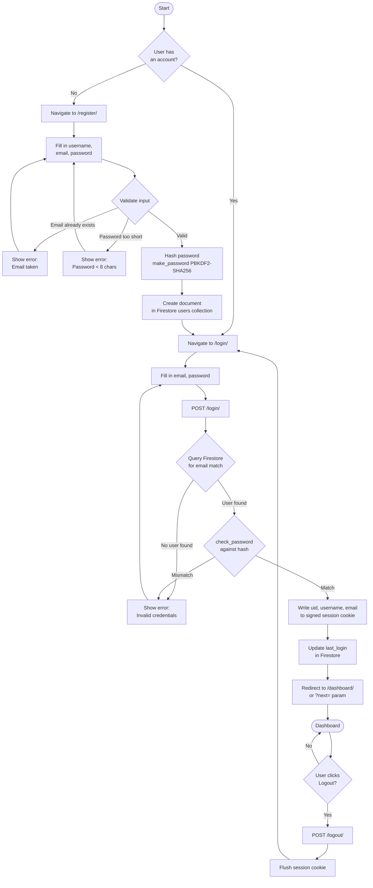
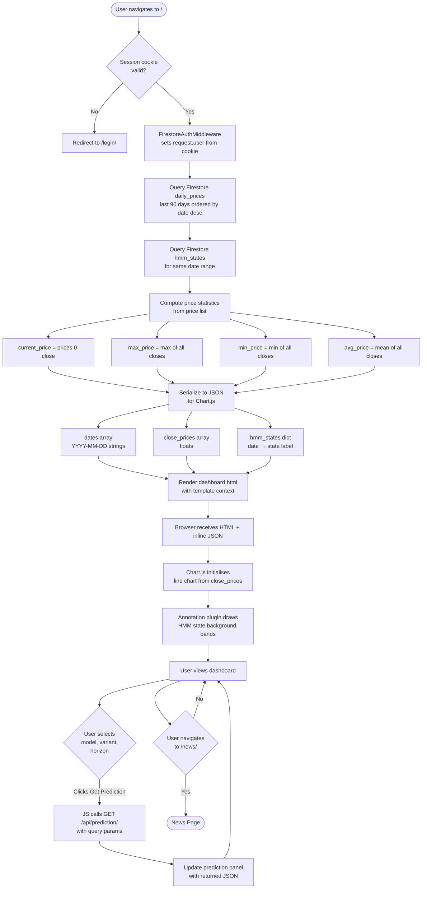
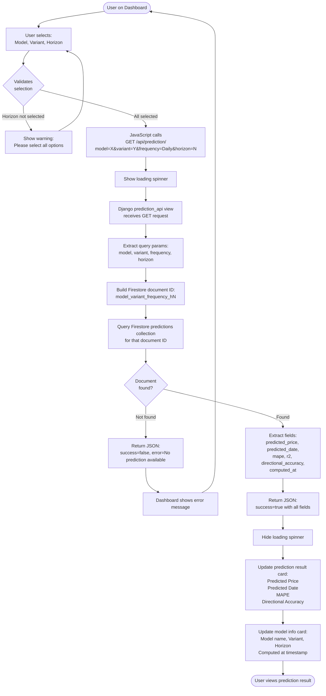

```mermaid
flowchart TD
    A([Cloud Scheduler Trigger\ndaily cron]) --> B[scheduler/main.py\n--mode daily]

    B --> C{Mode?}
    C -->|initial| INIT[Load all CSVs\nCheckpointed bulk load]
    C -->|daily| D

    INIT --> D

    D --> E[Step 1: Fetch Prices\nscheduler/price_fetcher.py]
    E --> E1{New data\nfrom API?}
    E1 -->|Yes| E2[Write new daily_prices\ndocuments to Firestore]
    E1 -->|No| E3[Log: prices up to date]
    E2 --> F
    E3 --> F

    F[Step 2: Scrape News\nscheduler/news_extractor.py] --> F1[GET MPOB website\nBeautifulSoup parsing]
    F1 --> F2{New articles\nfound?}
    F2 -->|Yes| F3[Deduplicate by MD5 url]
    F3 --> F4[Write new news_articles\nto Firestore]
    F2 -->|No| F5[Log: news up to date]
    F4 --> G
    F5 --> G

    G[Step 3: Sentiment Analysis\nscheduler/sentiment_runner.py] --> G1[Find articles without\nsentiment_label]
    G1 --> G2{Unlabelled\narticles?}
    G2 -->|Yes| G3[Run FinBERT inference\nGPU-accelerated batches]
    G3 --> G4[Update news_articles\nwith labels + scores]
    G4 --> G5[Recompute sentiment_aggregates\nfor affected dates]
    G5 --> G6[Write to Firestore]
    G2 -->|No| G7[Log: sentiment up to date]
    G6 --> H
    G7 --> H

    H[Step 4: Update HMM States\nscheduler/hmm_updater.py] --> H1[Load all daily_prices\nfrom Firestore]
    H1 --> H2[Compute log-returns]
    H2 --> H3[Fit GaussianHMM\n2-5 states, BIC selection]
    H3 --> H4[Label states:\nBullish / Bearish / Neutral\nbased on mean return]
    H4 --> H5[Write all hmm_states\nto Firestore]
    H5 --> I

    I[Step 5: Compute Predictions\nscheduler/prediction_updater.py] --> I1[Build feature dataset\ncreate_prediction_dataset.py]
    I1 --> I2[Merge price + HMM + sentiment\n60+ engineered features]

    I2 --> I3[For each of 56 combinations\n4 models x 3 variants x 7 horizons]

    I3 --> I4{Model type?}
    I4 -->|XGBoost or\nRandom Forest| I5[Load cached model\nfrom GCS or retrain]
    I4 -->|ARIMAX or\nSARIMAX| I6[Fit statsmodels\non latest data window]

    I5 --> I7{Variant?}
    I6 --> I7

    I7 -->|base| I8[Use default\nhyperparameters]
    I7 -->|csa| I9[Run Crow Search Algorithm\ncsa_hyperparameter_optimizer.py]
    I7 -->|bayesian| I10[Run Bayesian Optimisation\nbayesian_optimizer.py]

    I8 --> I11[Generate h-step\nahead prediction]
    I9 --> I11
    I10 --> I11

    I11 --> I12[Compute test set metrics\nMAPE, R2, RMSE, DA]
    I12 --> I13{More combinations?}
    I13 -->|Yes| I3
    I13 -->|No| I14[56 predictions complete]

    I14 --> J[Step 6: Write to Firestore\nscheduler/firestore_writer.py]
    J --> J1[Chunk into 500-doc batches\nFirestore batch limit]
    J1 --> J2[Commit batches\nidempotent overwrite]
    J2 --> K([Pipeline complete\nDashboard data refreshed])
```

# Activity Diagrams — CPO Price Prediction System

Four activity flows are documented here:
1. [User Authentication Flow](#1-user-authentication-flow)
2. [Dashboard Load Flow](#2-dashboard-load-flow)
3. [Prediction Request Flow](#3-prediction-request-flow)
4. [Daily Scheduler Pipeline](#4-daily-scheduler-pipeline)

---

## 1. User Authentication Flow

### Diagram

### Activity Descriptions

| Step | Actor | Description |
|---|---|---|
| User has an account? | User | Branch point: directs to register or login |
| Fill registration form | User | Enters username, email, and password on `/register/` |
| Validate input | System | Checks for duplicate email (Firestore query) and password length ≥ 8 |
| Show error: Email taken | System | Re-renders `/register/` with validation error message |
| Show error: Password < 8 chars | System | Re-renders `/register/` with validation error message |
| Hash password | System | Calls Django `make_password()` → PBKDF2-SHA256 hash |
| Create user in Firestore | System | Writes new document to `users` collection with `is_active=True` |
| Fill login form | User | Enters email and password on `/login/` |
| Query Firestore for email | System | `users.where("email", "==", email_lower).limit(1)` |
| check_password | System | Verifies submitted password against stored hash |
| Write session cookie | System | Stores `_uid`, `_username`, `_email` in signed Django session |
| Update last_login | System | Asynchronously updates Firestore `users` document |
| Redirect to dashboard | System | Sends 302 to `/` or to `?next=` destination |
| Flush session cookie | System | `request.session.flush()` — invalidates the cookie |

**Key Files:** `website/web/views.py` (`login_view`, `register_view`, `logout_view`), `website/web/auth_backend.py`

---

## 2. Dashboard Load Flow

### Diagram

### Activity Descriptions

| Step | Actor | Description |
|---|---|---|
| Session cookie valid? | System | `FirestoreAuthMiddleware` checks signed cookie on every request |
| Redirect to /login/ | System | 302 redirect; `?next=/` appended so user returns after login |
| Set request.user | System | Builds `FirestoreUser` from cookie values; checks in-memory UID cache |
| Query daily_prices | System | Firestore `daily_prices` ordered by `date` descending, limit 90 |
| Query hmm_states | System | Firestore `hmm_states` where `frequency == "Daily"` and `date in [date_list]` |
| Compute price statistics | System | Python list comprehension over the 90 price documents |
| Serialize to JSON | System | `json.dumps()` of arrays; injected as `{{ chart_data\|safe }}` in template |
| Render dashboard.html | System | Django template engine renders with full context dict |
| Chart.js initialises | Browser | Parses inline JSON, builds `Chart` instance with line dataset |
| Annotation plugin draws bands | Browser | Groups consecutive same-state dates; draws colored rectangles |
| User selects prediction params | User | Dropdown selectors in the prediction control panel |
| JS calls /api/prediction/ | Browser | `fetch()` with query string parameters |
| Update prediction panel | Browser | DOM manipulation to show price, date, metrics |

**Key Files:** `website/web/views.py` (`dashboard`), `website/web/auth_backend.py`, `website/web/templates/dashboard.html`

---

## 3. Prediction Request Flow

### Diagram

### Activity Descriptions

| Step | Actor | Description |
|---|---|---|
| User selects model/variant/horizon | User | Three dropdowns in the prediction control panel on the dashboard |
| Validates selection | Browser JS | Checks all three dropdowns have a non-empty value |
| Show warning | Browser JS | Inline validation message; no API call made |
| Call /api/prediction/ | Browser JS | `fetch()` GET request with `URLSearchParams` |
| Show loading spinner | Browser JS | CSS spinner shown while awaiting response |
| Django receives request | System | `prediction_api()` view decorated with `@firestore_login_required` |
| Extract query params | System | `request.GET.get("model")`, etc. |
| Build document ID | System | String concatenation: `f"{model}_{variant}_{frequency}_h{horizon}"` |
| Query Firestore predictions | System | `.collection("predictions").document(doc_id).get()` |
| Document not found | System | Returns `{"success": false, "error": "..."}` with HTTP 200 |
| Extract fields | System | Access `.to_dict()` on the Firestore document snapshot |
| Return JSON | System | `JsonResponse({"success": true, ...})` |
| Update prediction card | Browser JS | DOM manipulation using returned field values |
| Update model info card | Browser JS | Shows which model config produced this prediction |

**Key Files:** `website/web/views.py` (`prediction_api`), `website/web/templates/dashboard.html` (JS section)

---

## 4. Daily Scheduler Pipeline

### Diagram

### Activity Descriptions

| Step | Actor | Description |
|---|---|---|
| Cloud Scheduler Trigger | External | GCP Cloud Scheduler fires HTTP request to Cloud Run endpoint once per day |
| scheduler/main.py | System | Entry point; parses `--mode` argument; dispatches to each step |
| Fetch Prices | System | Calls Investing.com API for latest CPO close; writes only new date documents |
| Scrape News | System | Multi-threaded BeautifulSoup scraper against MPOB website |
| Deduplicate by MD5(url) | System | `hashlib.md5(url.encode()).hexdigest()` used as Firestore doc ID |
| FinBERT Sentiment | System | `AutoTokenizer` + `AutoModelForSequenceClassification` (ProsusAI/finbert); batched GPU inference |
| Recompute aggregates | System | Groups news by date; computes `positive_prob`, `negative_prob`, `neutral_prob`, weighted `sentiment_score` |
| Fit GaussianHMM | System | `hmmlearn.GaussianHMM`; number of states selected by BIC criterion (2–5 candidates) |
| Label states | System | States are relabeled post-fit: highest mean-return state = Bullish, lowest = Bearish |
| Build feature dataset | System | `create_prediction_dataset.py` merges three data sources; engineers lag features, sin/cos cyclical features, returns |
| 56 combinations loop | System | Outer loop: 4 models × 3 variants × 7 horizons (some model-variant combos may be skipped) |
| CSA optimization | System | Stochastic Crow Search metaheuristic (`prediction/csa_hyperparameter_optimizer.py`) |
| Bayesian optimization | System | Gaussian Process surrogate model (`prediction/bayesian_optimizer.py`) |
| Compute metrics | System | Evaluated on held-out test split (15% of historical data, newest dates) |
| Write to Firestore | System | `firestore_writer.py`; uses `batch.set()` with merge=False; document ID is deterministic string |

**Key Files:** `scheduler/main.py`, `scheduler/price_fetcher.py`, `scheduler/news_extractor.py`, `scheduler/sentiment_runner.py`, `scheduler/hmm_updater.py`, `scheduler/prediction_updater.py`, `scheduler/firestore_writer.py`, `prediction/horizon_forecast.py`, `prediction/bayesian_optimizer.py`, `prediction/csa_hyperparameter_optimizer.py`
