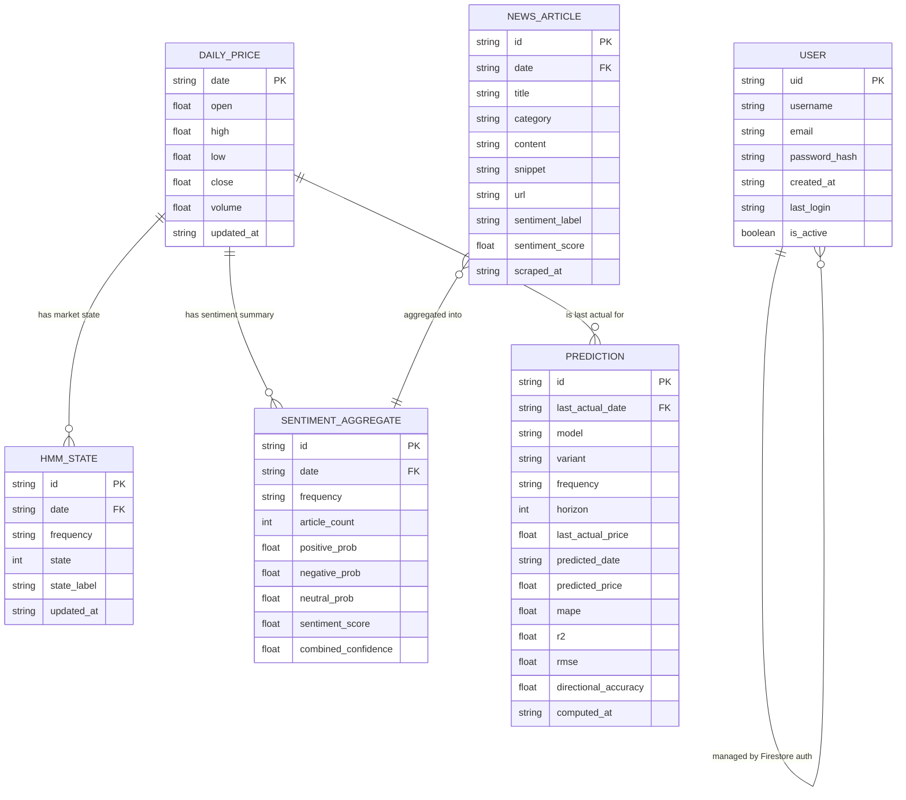

# Entity Relationship Diagram — CPO Price Prediction System

## Diagram

---

## Entity Descriptions

### USER
Stored in Firestore collection: `users`
Document ID: auto-generated UID

| Field | Type | Description |
|---|---|---|
| `uid` | string | Primary key — auto-generated Firestore document ID |
| `username` | string | Display name chosen at registration |
| `email` | string | Lowercased email address; enforced unique at application level |
| `password_hash` | string | Django `make_password()` hash (PBKDF2-SHA256) |
| `created_at` | ISO timestamp | Account creation time |
| `last_login` | ISO timestamp | Updated on each successful login |
| `is_active` | boolean | Account status flag; inactive users cannot log in |

**Purpose:** Manages access to the dashboard. Authentication is handled by a custom Firestore middleware (`website/web/auth_backend.py`) — there is no Django ORM or SQL database for users.

---

### DAILY_PRICE
Stored in Firestore collection: `daily_prices`
Document ID: `YYYY-MM-DD`

| Field | Type | Description |
|---|---|---|
| `date` | string (YYYY-MM-DD) | Primary key — the trading day |
| `open` | float | Opening price (MYR/tonne) |
| `high` | float | Intraday high price |
| `low` | float | Intraday low price |
| `close` | float | Closing price — primary target variable for prediction |
| `volume` | float | Traded volume |
| `updated_at` | ISO timestamp | Last write time |

**Purpose:** Core time-series data. Source is `cpo/Data_CPO_Daily.csv` (initial load) and Investing.com API (incremental). Used as input to all ML models, the HMM, and the dashboard chart.

---

### HMM_STATE
Stored in Firestore collection: `hmm_states`
Document ID: `{frequency}_{YYYY-MM-DD}` e.g. `Daily_2025-04-15`

| Field | Type | Description |
|---|---|---|
| `id` | string | Composite PK: `{frequency}_{date}` |
| `date` | string | Foreign key to `DAILY_PRICE.date` |
| `frequency` | string | Temporal resolution — currently `"Daily"` |
| `state` | int | Discrete market regime: `0` = Bearish, `1` = Bullish, `2` = Neutral |
| `state_label` | string | Human-readable label: `"Bearish"`, `"Bullish"`, `"Neutral"` |
| `updated_at` | ISO timestamp | Last HMM re-fit time |

**Purpose:** Each date is assigned one of three market regimes by a Gaussian HMM fitted to log-returns (`markov/cpo_hmm_states.py`). The dashboard uses these states to color-shade chart background regions (green = bullish, red = bearish, gray = neutral). The state integer is also used as an exogenous feature in ML models.

---

### NEWS_ARTICLE
Stored in Firestore collection: `news_articles`
Document ID: `md5(url)` — stable hash for deduplication

| Field | Type | Description |
|---|---|---|
| `id` | string | MD5 hash of the article URL (deduplication key) |
| `date` | string | Publication date — foreign key to `DAILY_PRICE.date` |
| `title` | string | Article headline |
| `category` | string | MPOB category (e.g. "Market", "Production", "Export") |
| `content` | string | Full article body text |
| `snippet` | string | First ~200 characters for news-card preview |
| `url` | string | Canonical article URL from MPOB website |
| `sentiment_label` | string | FinBERT output: `"Positive"`, `"Negative"`, `"Neutral"` |
| `sentiment_score` | float | FinBERT confidence-weighted sentiment score [−1, +1] |
| `scraped_at` | ISO timestamp | When the article was scraped |

**Purpose:** Scraped from MPOB (Malaysian Palm Oil Board) via `news/scrap_fast.py`. Sentiment scored by FinBERT (`news/finbert_sentiment_analysis_flexible.py`). Displayed on the `/news/` page with filter and pagination.

---

### SENTIMENT_AGGREGATE
Stored in Firestore collection: `sentiment_aggregates`
Document ID: `{frequency}_{YYYY-MM-DD}` e.g. `Daily_2025-04-15`

| Field | Type | Description |
|---|---|---|
| `id` | string | Composite PK: `{frequency}_{date}` |
| `date` | string | Foreign key to `DAILY_PRICE.date` |
| `frequency` | string | Temporal resolution — `"Daily"` |
| `article_count` | int | Number of articles for this date |
| `positive_prob` | float | Fraction of articles labeled Positive |
| `negative_prob` | float | Fraction of articles labeled Negative |
| `neutral_prob` | float | Fraction of articles labeled Neutral |
| `sentiment_score` | float | Weighted aggregate sentiment score |
| `combined_confidence` | float | Mean FinBERT confidence across all articles |

**Purpose:** Collapses many `NEWS_ARTICLE` documents for a single date into one feature vector. This aggregate is merged into the prediction feature dataset (`create_prediction_dataset.py`) alongside price and HMM state data. Lagged versions (t-1 to t-10) are used as exogenous features in ARIMAX/SARIMAX models.

---

### PREDICTION
Stored in Firestore collection: `predictions`
Document ID: `{model}_{variant}_{frequency}_h{horizon}` e.g. `xgboost_csa_Daily_h1`

| Field | Type | Description |
|---|---|---|
| `id` | string | Composite PK encoding model config and horizon |
| `last_actual_date` | string | Foreign key — the last known price date used as input |
| `model` | string | ML algorithm: `"xgboost"`, `"random_forest"`, `"arimax"`, `"sarimax"` |
| `variant` | string | Optimization method: `"base"`, `"csa"`, `"bayesian"` |
| `frequency` | string | Data frequency: `"Daily"` |
| `horizon` | int | Steps ahead: 1 to 7 |
| `last_actual_price` | float | The most recent known CPO closing price |
| `predicted_date` | string | Date of the forecasted price |
| `predicted_price` | float | Forecasted CPO closing price (MYR/tonne) |
| `mape` | float | Mean Absolute Percentage Error (%) on test set |
| `r2` | float | R² coefficient of determination on test set |
| `rmse` | float | Root Mean Squared Error on test set |
| `directional_accuracy` | float | % of correct up/down movement predictions |
| `computed_at` | ISO timestamp | When the prediction was generated |

**Purpose:** Pre-computed by the scheduler (`scheduler/prediction_updater.py`). There are 56 documents total (4 models × 3 variants × 7 horizons minus 4 base-only = actually 4×3×7 = 84, but some models skip variants). The dashboard `/api/prediction/` endpoint reads directly from this collection, so the web server never runs ML inference at request time.

---

## Relationship Descriptions

| Relationship | Cardinality | Description |
|---|---|---|
| `DAILY_PRICE` → `HMM_STATE` | One-to-Many | One price date maps to one HMM state per frequency. Currently only `Daily` frequency exists, giving a 1:1 effective mapping. |
| `DAILY_PRICE` → `SENTIMENT_AGGREGATE` | One-to-Many | One price date has one sentiment aggregate per frequency. Aggregated from all news articles on that date. |
| `NEWS_ARTICLE` → `SENTIMENT_AGGREGATE` | Many-to-One | Multiple news articles published on the same date are folded into a single aggregate feature row. |
| `DAILY_PRICE` → `PREDICTION` | One-to-Many | One price date can be `last_actual_date` for multiple predictions (up to 84 different model configurations). |
| `USER` (self) | N/A | Users are independent; no ownership or foreign key links to price/prediction data. All data is shared and public once logged in. |

---

## Notes on Storage

- Firestore is a **document-oriented NoSQL** database. There are no enforced foreign keys — relationships are maintained by matching `date` strings across collections.
- Document IDs are carefully designed to be **idempotent keys**: re-running the scheduler overwrites rather than duplicates documents.
- There is **no Django ORM** in use. All Firestore access goes through the Google Cloud Firestore SDK (`google-cloud-firestore`), wrapped in `website/web/firebase_backend.py` and `scheduler/firestore_writer.py`.
