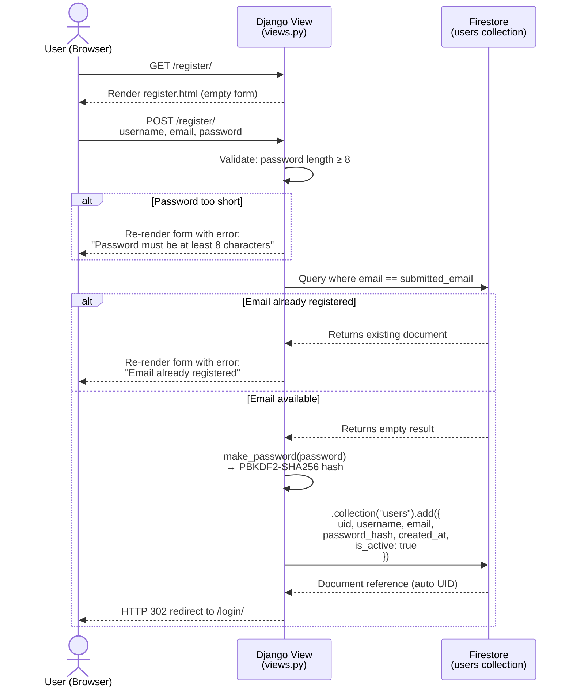
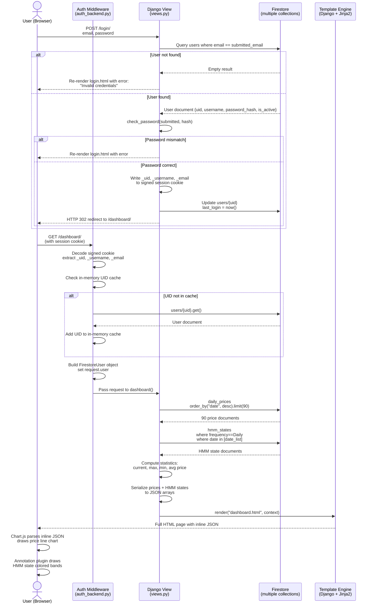
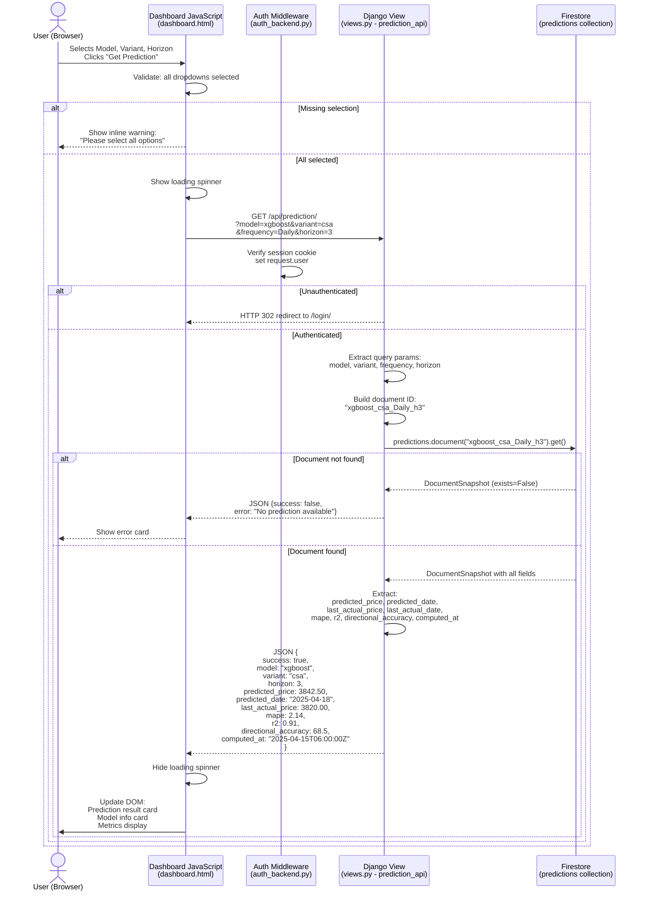
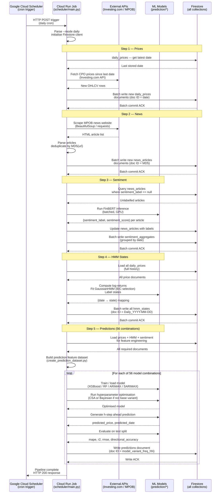

# Sequence Diagrams — CPO Price Prediction System

Four interaction flows are documented here:
1. [User Registration](#1-user-registration)
2. [User Login and Dashboard Load](#2-user-login-and-dashboard-load)
3. [Prediction API Call](#3-prediction-api-call)
4. [Daily Scheduler Pipeline Run](#4-daily-scheduler-pipeline-run)

---

## 1. User Registration

### Diagram

### Message Descriptions

| # | From | To | Message | Description |
|---|---|---|---|---|
| 1 | User | Django View | `GET /register/` | User navigates to registration page |
| 2 | Django View | User | `render register.html` | Empty form rendered from `website/web/templates/register.html` |
| 3 | User | Django View | `POST /register/` | Form submission with `username`, `email`, `password` fields |
| 4 | Django View | Django View | `validate password length` | Local check: `len(password) < 8` → error |
| 5 | Django View | Firestore | `query email` | `users.where("email", "==", email.lower()).limit(1)` |
| 6 | Firestore | Django View | `existing doc` | If a document is returned, email is taken |
| 7 | Django View | User | `re-render with error` | Template re-rendered with `{"error": "Email already registered"}` context |
| 8 | Django View | Django View | `make_password()` | Django's `hashers.make_password()` → PBKDF2-SHA256 |
| 9 | Django View | Firestore | `.add({...})` | New `users` document with all required fields |
| 10 | Firestore | Django View | `document reference` | Returns the auto-generated UID |
| 11 | Django View | User | `302 /login/` | Redirect to login page |

**Key Files:** `website/web/views.py` → `register_view()`, `website/web/auth_backend.py`

---

## 2. User Login and Dashboard Load

### Diagram

### Message Descriptions

| # | From | To | Message | Description |
|---|---|---|---|---|
| 1 | User | Django View | `POST /login/` | Email + password submitted |
| 2 | Django View | Firestore | `query users by email` | Exact-match query on lowercased email |
| 3 | Firestore | Django View | `user document` | Returns dict with `password_hash`, `uid`, `is_active` |
| 4 | Django View | Django View | `check_password()` | Django's `hashers.check_password()` |
| 5 | Django View | Django View | `write session cookie` | `request.session["_uid"] = uid` etc; Django signs the cookie |
| 6 | Django View | Firestore | `update last_login` | `users.document(uid).update({"last_login": now})` |
| 7 | Django View | User | `302 /dashboard/` | Redirect with `Set-Cookie` header |
| 8 | User | Auth Middleware | `GET /dashboard/` | Browser sends the session cookie |
| 9 | Auth Middleware | Auth Middleware | `decode cookie` | `request.session.get("_uid")` |
| 10 | Auth Middleware | Auth Middleware | `check UID cache` | Module-level dict `{uid: FirestoreUser}` |
| 11 | Auth Middleware | Firestore | `users/{uid}.get()` | Only on cache miss |
| 12 | Auth Middleware | Auth Middleware | `set request.user` | Attaches `FirestoreUser` instance to request |
| 13 | Auth Middleware | Django View | `pass request` | Middleware chain continues to view |
| 14 | Django View | Firestore | `daily_prices query` | `.order_by("date", direction=DESCENDING).limit(90)` |
| 15 | Django View | Firestore | `hmm_states query` | `.where("date", "in", date_list)` |
| 16 | Django View | Django View | `compute stats` | Simple Python `max()`, `min()`, `sum()/len()` |
| 17 | Django View | Django View | `serialize to JSON` | `json.dumps({"dates": [...], "prices": [...], "states": {...}})` |
| 18 | Django View | Template Engine | `render dashboard.html` | Django `render(request, "dashboard.html", context)` |
| 19 | Template Engine | User | `HTML with inline JSON` | `{{ chart_data\|safe }}` outputs the JSON directly into a `<script>` tag |
| 20 | User (browser) | User (browser) | `Chart.js init` | JavaScript parses the JSON and instantiates a Chart.js line chart |
| 21 | User (browser) | User (browser) | `draw HMM bands` | Annotation plugin groups consecutive same-state dates into background rectangles |

**Key Files:** `website/web/views.py`, `website/web/auth_backend.py`, `website/web/templates/dashboard.html`

---

## 3. Prediction API Call

### Diagram

### Message Descriptions

| # | From | To | Message | Description |
|---|---|---|---|---|
| 1 | User | JS | `selects + clicks` | User interaction with dropdowns and button in prediction control panel |
| 2 | JS | JS | `validate dropdowns` | Checks `select.value !== ""` for all three dropdowns |
| 3 | JS | JS | `show spinner` | CSS class toggled to display loading indicator |
| 4 | JS | Django View | `GET /api/prediction/` | `fetch("/api/prediction/?" + new URLSearchParams({...}))` |
| 5 | Auth Middleware | Auth Middleware | `verify cookie` | `FirestoreAuthMiddleware` populates `request.user` before view runs |
| 6 | Auth Middleware | JS | `302 redirect` | If cookie invalid/missing; JS `fetch()` follows redirect to login page |
| 7 | Django View | Django View | `extract params` | `request.GET.get("model", "")` for each parameter |
| 8 | Django View | Django View | `build doc ID` | `f"{model}_{variant}_{frequency}_h{horizon}"` |
| 9 | Django View | Firestore | `.document(id).get()` | Single-document read — O(1) latency |
| 10 | Firestore | Django View | `DocumentSnapshot` | `.exists` is `False` if no such document |
| 11 | Django View | JS | `{success: false}` | `JsonResponse({"success": False, "error": "..."})`; HTTP 200 |
| 12 | Django View | Django View | `extract fields` | `doc.to_dict()` then pick required keys |
| 13 | Django View | JS | `{success: true, ...}` | `JsonResponse({...})` with all prediction fields |
| 14 | JS | JS | `hide spinner` | CSS class removed |
| 15 | JS | User | `update DOM` | `document.getElementById("predicted-price").textContent = ...` |

**Key Files:** `website/web/views.py` → `prediction_api()`, `website/web/templates/dashboard.html` (JavaScript section)

---

## 4. Daily Scheduler Pipeline Run

### Diagram

### Message Descriptions

| # | From | To | Message | Description |
|---|---|---|---|---|
| 1 | Cloud Scheduler | Cloud Run | `HTTP POST trigger` | GCP Cloud Scheduler fires the daily job |
| 2 | Cloud Run | Cloud Run | `parse args + init` | `argparse` reads `--mode daily`; Firestore client created with service account |
| 3 | Cloud Run | Firestore | `get latest price date` | Finds the most recent `daily_prices` document date to determine what's missing |
| 4 | Cloud Run | Investing.com API | `fetch prices` | HTTP request for CPO futures OHLCV data since last stored date |
| 5 | Cloud Run | Firestore | `batch write daily_prices` | Uses `scheduler/firestore_writer.py`; 500-doc batch limit enforced |
| 6 | Cloud Run | MPOB website | `scrape news` | `requests.get()` + BeautifulSoup; multi-threaded via `ThreadPoolExecutor` |
| 7 | Cloud Run | Cloud Run | `deduplicate` | MD5 hash of URL compared against already-stored document IDs |
| 8 | Cloud Run | Firestore | `batch write news_articles` | Document ID = `md5(url)` ensures idempotency |
| 9 | Cloud Run | Firestore | `query unlabelled articles` | `news_articles.where("sentiment_label", "==", None)` |
| 10 | Cloud Run | FinBERT (ML) | `run inference` | `AutoModelForSequenceClassification` from HuggingFace; GPU-batched |
| 11 | Cloud Run | Firestore | `update articles + aggregates` | Article-level labels written; then per-date aggregates computed and written |
| 12 | Cloud Run | Firestore | `load all prices` | Full history needed for GaussianHMM fitting (stateful model) |
| 13 | Cloud Run | HMM (ML) | `fit GaussianHMM` | `hmmlearn.GaussianHMM`; BIC criterion tests 2–5 states |
| 14 | Cloud Run | Firestore | `batch write hmm_states` | All states rewritten (entire history) due to HMM re-labelling |
| 15 | Cloud Run | Firestore | `load feature data` | Prices + HMM + sentiment all loaded for `create_prediction_dataset.py` |
| 16 | Cloud Run | Cloud Run | `build feature dataset` | Merges three sources; engineers 60+ lag, return, cyclical, and indicator features |
| 17 | Cloud Run | ML Models | `train/load model` | XGBoost/RF: load from GCS cache or retrain; ARIMAX/SARIMAX: always refit |
| 18 | Cloud Run | ML Models | `hyperparameter opt` | CSA (`prediction/csa_hyperparameter_optimizer.py`) or Bayesian (`prediction/bayesian_optimizer.py`) |
| 19 | Cloud Run | ML Models | `generate prediction` | Single h-step-ahead forecast for the next `horizon` trading days |
| 20 | Cloud Run | ML Models | `evaluate on test split` | 15% most-recent data held out; MAPE, R², RMSE, directional accuracy computed |
| 21 | Cloud Run | Firestore | `write predictions doc` | `predictions.document(f"{model}_{variant}_{freq}_h{h}").set({...})` |
| 22 | Cloud Run | Cloud Scheduler | `200 OK` | Job completion signal; Cloud Scheduler records success |

**Key Files:** `scheduler/main.py`, `scheduler/price_fetcher.py`, `scheduler/news_extractor.py`, `scheduler/sentiment_runner.py`, `scheduler/hmm_updater.py`, `scheduler/prediction_updater.py`, `scheduler/firestore_writer.py`, `prediction/horizon_forecast.py`, `prediction/bayesian_optimizer.py`, `prediction/csa_hyperparameter_optimizer.py`, `markov/cpo_hmm_states.py`, `news/finbert_sentiment_analysis_flexible.py`
