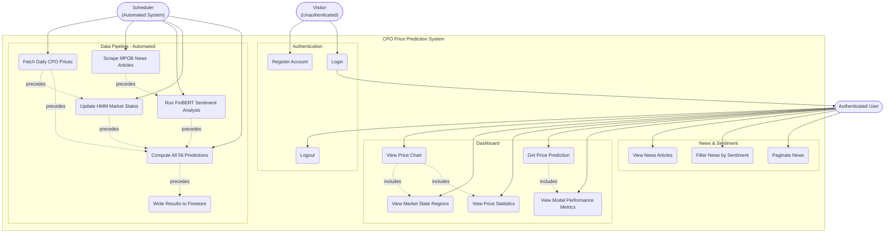

# Use Case Diagram — CPO Price Prediction System

## Diagram

---

## Actors

### Visitor (Unauthenticated)
A person who accesses the website without a session. They can only interact with the public-facing authentication pages.

| Attribute | Detail |
|---|---|
| Access Level | Public pages only (`/login/`, `/register/`) |
| Blocked From | All dashboard, news, and API pages (redirected to `/login/`) |
| Identified By | Absence of a valid signed session cookie |

---

### Authenticated User
A person who has registered an account and completed login. The session is stored in a signed HTTP-only cookie managed by Django's `SessionMiddleware`.

| Attribute | Detail |
|---|---|
| Access Level | All protected pages: `/`, `/news/`, `/about/`, `/api/prediction/` |
| Session Storage | Signed Django session cookie (no server-side session store) |
| Identity | UID, username, email from Firestore `users` collection |
| Identified By | Valid `_uid`, `_username`, `_email` values in signed session cookie |

---

### Scheduler (Automated System)
A non-human actor representing the Cloud Run / cron-triggered job defined in `scheduler/main.py`. It runs once per day and has no user interface.

| Attribute | Detail |
|---|---|
| Trigger | Daily cron schedule (Cloud Scheduler → Cloud Run) |
| Modes | `--mode initial` (one-time bulk load), `--mode daily` (incremental update) |
| Entry Point | `scheduler/main.py` |
| Permissions | Full Firestore read/write access via service account |

---

## Use Case Descriptions

### Authentication Use Cases

#### UC1 — Register Account
- **Actor:** Visitor
- **Trigger:** User navigates to `/register/` and submits the form
- **Precondition:** User does not already have an account with the same email
- **Flow:**
  1. User submits username, email, password
  2. System validates: no duplicate email, password ≥ 8 characters
  3. System hashes password with Django's `make_password()` (PBKDF2-SHA256)
  4. System creates a new document in Firestore `users` collection
  5. User is redirected to `/login/`
- **Alternative:** If email already exists or password too short → form re-renders with error
- **Implementation:** `website/web/views.py` → `register_view()`

#### UC2 — Login
- **Actor:** Visitor
- **Trigger:** User submits email and password on `/login/`
- **Precondition:** Account exists and is active
- **Flow:**
  1. User submits email + password
  2. System queries Firestore for a `users` document where `email == submitted_email`
  3. System verifies password with `check_password()`
  4. System writes UID, username, email into signed session cookie
  5. System updates `last_login` timestamp in Firestore
  6. User is redirected to `/` (or `?next=` parameter destination)
- **Alternative:** Wrong credentials → error message, no session created
- **Implementation:** `website/web/views.py` → `login_view()`

#### UC3 — Logout
- **Actor:** Authenticated User
- **Trigger:** User clicks "Logout" in the navigation bar
- **Flow:**
  1. POST request to `/logout/`
  2. System calls `request.session.flush()` — clears the signed session cookie
  3. User is redirected to `/login/`
- **Implementation:** `website/web/views.py` → `logout_view()`

---

### Dashboard Use Cases

#### UC4 — View Price Chart
- **Actor:** Authenticated User
- **Trigger:** User navigates to `/` (dashboard)
- **Flow:**
  1. System fetches last 90 days of `daily_prices` from Firestore
  2. System fetches corresponding `hmm_states` for those dates
  3. System serializes data as JSON and injects into template context
  4. Browser renders Chart.js line chart with OHLCV data
  5. HMM state regions are drawn as colored background bands
- **Includes:** UC5 (Market State Regions), UC6 (Price Statistics)
- **Implementation:** `website/web/views.py` → `dashboard()`, `website/web/templates/dashboard.html`

#### UC5 — View Market State Regions
- **Actor:** Authenticated User (via UC4)
- **Trigger:** Automatically rendered as part of dashboard load
- **Flow:**
  1. `hmm_states` documents retrieved alongside price data
  2. Consecutive dates with the same state are grouped into bands
  3. Chart.js `annotation` plugin draws colored rectangles on the chart:
     - **Green** = Bullish (state 1)
     - **Red** = Bearish (state 0)
     - **Gray** = Neutral (state 2)
- **Implementation:** `dashboard.html` JavaScript section

#### UC6 — View Price Statistics
- **Actor:** Authenticated User (via UC4)
- **Trigger:** Automatically rendered as part of dashboard load
- **Flow:**
  1. System computes summary statistics from the 90-day price window:
     - Current close price (latest date)
     - Maximum close in window
     - Minimum close in window
     - Average close in window
  2. Statistics displayed in metric cards above the chart
- **Implementation:** `website/web/views.py` → `dashboard()` context computation

#### UC7 — Get Price Prediction
- **Actor:** Authenticated User
- **Trigger:** User selects model, variant, horizon and clicks "Get Prediction"
- **Precondition:** Pre-computed predictions exist in Firestore for selected config
- **Flow:**
  1. User selects: Model (XGBoost / Random Forest / ARIMAX / SARIMAX), Variant (Base / CSA / Bayesian), Horizon (1–7 days)
  2. Browser JS calls `GET /api/prediction/?model=...&variant=...&frequency=Daily&horizon=...`
  3. Django view queries Firestore `predictions` collection for document `{model}_{variant}_Daily_h{horizon}`
  4. Response JSON returned: predicted price, predicted date, MAPE, directional accuracy
  5. Dashboard UI updates to show the result
- **Includes:** UC8 (Model Performance Metrics shown alongside prediction)
- **Implementation:** `website/web/views.py` → `prediction_api()`

#### UC8 — View Model Performance Metrics
- **Actor:** Authenticated User (via UC7)
- **Trigger:** Returned alongside prediction result
- **Flow:**
  1. Metrics retrieved from the `predictions` document:
     - MAPE (Mean Absolute Percentage Error)
     - R² (coefficient of determination)
     - Directional Accuracy (% correct up/down)
     - RMSE (Root Mean Squared Error)
  2. Displayed in a metrics panel on the dashboard

---

### News & Sentiment Use Cases

#### UC9 — View News Articles
- **Actor:** Authenticated User
- **Trigger:** User navigates to `/news/`
- **Flow:**
  1. System queries Firestore `news_articles` collection, ordered by date descending
  2. Articles paginated at 9 per page
  3. Each article card shows: title, date, category, sentiment badge (colored), snippet
- **Implementation:** `website/web/views.py` → `news()`

#### UC10 — Filter News by Sentiment
- **Actor:** Authenticated User
- **Trigger:** User clicks a sentiment filter button (All / Positive / Negative / Neutral)
- **Flow:**
  1. Filter state passed as URL query parameter `?sentiment=Positive`
  2. System adds `where("sentiment_label", "==", filter)` to Firestore query
  3. Filtered results rendered; active filter button highlighted
  4. Sentiment counts (per label + total) displayed in stats cards
- **Implementation:** `website/web/views.py` → `news()` with query param handling

#### UC11 — Paginate News
- **Actor:** Authenticated User
- **Trigger:** User clicks "Next", "Previous", or a page number
- **Flow:**
  1. `?page=N` query parameter read by view
  2. Firestore query uses `offset` and `limit` to fetch correct page slice
  3. Pagination controls rendered: prev/next buttons, page number chips
- **Implementation:** `website/web/views.py` → `news()` pagination logic

---

### Data Pipeline Use Cases (Scheduler)

#### UC12 — Fetch Daily CPO Prices
- **Actor:** Scheduler
- **Flow:**
  - **Initial mode:** Parse `cpo/Data_CPO_Daily.csv`, write all rows to Firestore `daily_prices`
  - **Daily mode:** Call Investing.com API for latest trading data; write only new dates
- **Implementation:** `scheduler/price_fetcher.py`

#### UC13 — Scrape MPOB News Articles
- **Actor:** Scheduler
- **Flow:**
  - **Initial mode:** Load from `news/mpob_news_preprocessed.csv`
  - **Daily mode:** Multi-threaded scrape of MPOB website (`news/scrap_fast.py`); deduplicate by MD5(url)
- **Implementation:** `scheduler/news_extractor.py`

#### UC14 — Run FinBERT Sentiment Analysis
- **Actor:** Scheduler
- **Flow:**
  1. Iterate unseen news articles (no `sentiment_label`)
  2. Run GPU-accelerated FinBERT inference on each article's title + content
  3. Assign `sentiment_label` and `sentiment_score`
  4. Recompute `sentiment_aggregates` for affected dates
- **Implementation:** `scheduler/sentiment_runner.py`, `news/finbert_sentiment_analysis_flexible.py`

#### UC15 — Update HMM Market States
- **Actor:** Scheduler
- **Precondition:** New price data available (UC12 complete)
- **Flow:**
  1. Load all price data from Firestore
  2. Compute log-returns
  3. Re-fit GaussianHMM (2–5 states, BIC selection) on full history
  4. Re-label all states (Bullish/Bearish/Neutral based on mean return)
  5. Write updated `hmm_states` documents to Firestore
- **Implementation:** `scheduler/hmm_updater.py`, `markov/cpo_hmm_states.py`

#### UC16 — Compute All 56 Predictions
- **Actor:** Scheduler
- **Precondition:** UC12, UC14, UC15 all complete
- **Flow:**
  1. Build feature dataset by merging price + sentiment + HMM data
  2. For each of 56 combinations (4 models × 3 variants × 7 horizons — some combinations excluded):
     a. Load or train model (XGBoost/RF loaded from GCS cache; ARIMAX/SARIMAX re-fitted)
     b. Run hyperparameter optimization if CSA or Bayesian variant
     c. Generate h-step-ahead prediction
     d. Compute evaluation metrics on test set
  3. Write 56 `predictions` documents to Firestore
- **Implementation:** `scheduler/prediction_updater.py`, `prediction/horizon_forecast.py`

#### UC17 — Write Results to Firestore
- **Actor:** Scheduler (implicit — part of all pipeline steps)
- **Flow:**
  1. Batch writes via `scheduler/firestore_writer.py`
  2. Handles Firestore 500-document batch limit by chunking
  3. Idempotent: uses deterministic document IDs so re-runs overwrite, not duplicate
- **Implementation:** `scheduler/firestore_writer.py`
