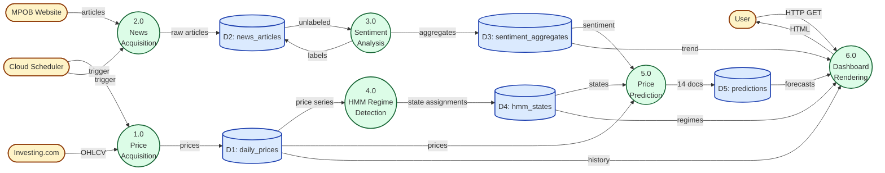
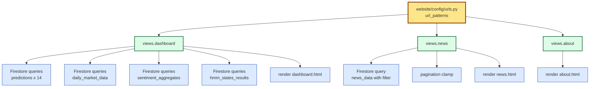
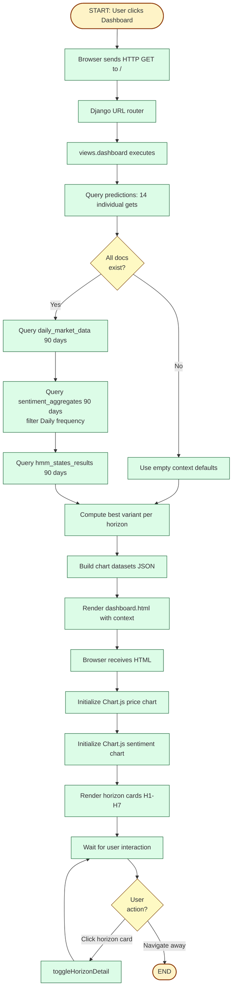

My thesis supervisor has explicitly mandated replacing UML diagrams with Structured Analysis & Design diagrams to match the function-based view (FBV) paradigm of the codebase. I need you to **generate four diagrams** based on the **actual current state of the codebase**, replacing the existing UML diagrams.

## Critical Context

**Existing diagrams to REPLACE (located in `diagrams/`):**
- `diagrams/use_case_diagram.html` — DELETE
- `diagrams/activity_diagram.html` — DELETE
- `diagrams/sequence_diagram.html` — DELETE
- (Any other UML-flavored diagram HTML files in this folder — identify and delete)

**These existing diagrams describe OUTDATED state** — they reference:
- Auth User actor (auth has been REMOVED in Phase A1)
- 4 models (RF, ARIMAX, SARIMAX, XGBoost — only XGBoost remains)
- 56 prediction combinations (current is 14 docs: 1 model × 2 variants × 7 horizons)
- Login/Register pages (REMOVED)
- ActivityLog entity (NEVER implemented)
- Bayesian optimizer (ARCHIVED)

**Do NOT use the old diagrams as reference for content.** They are misleading. Read the actual current code instead.

## Four Diagrams to Generate

Each diagram in its own HTML file in `diagrams/` folder, using **identical styling to the existing HTML diagrams** (Tailwind CDN + Mermaid CDN + matching color scheme). Match the structure: title section, narrative description, diagram in `<pre class="mermaid">`, then a table of element descriptions.

1. `diagrams/data_flow_diagram.html` — DFD Level 0 (Context) + Level 1 (System Decomposition)
2. `diagrams/structure_chart.html` — Module hierarchy of the scheduler pipeline
3. `diagrams/flowchart.html` — Daily scheduler pipeline control flow + user dashboard request flow
4. `diagrams/pseudocode.html` — Algorithmic pseudocode for key procedures

## Phase 1 — Pre-Execution Verification & Discovery

Before generating any diagram:

### 1.1 Branch & State Check

```bash
git branch --show-current
git status
```

Confirm: feature branch, clean working tree. If on main or dirty, ABORT.

### 1.2 Codebase Discovery

Read these directories thoroughly to understand actual current state:

**Required reads (use `view` tool):**
- `scheduler/` — list all files, focus on `main.py`, `firestore_writer.py`, `price_fetcher.py`, `news_extractor.py`, `sentiment_runner.py`, `hmm_updater.py`, `prediction_updater.py`
- `prediction/` — list all files, focus on `horizon_forecast_C1_price_only.py`, `horizon_forecast_C2_price_hmm.py`, `horizon_forecast_C3_price_sentiment.py`, `horizon_forecast_C4_full.py`, and the baselines folder
- `website/web/views.py` — entire file
- `website/web/templates/` — list files
- `markov/cpo_hmm_states.py` — function structure
- `news/finbert_sentiment_analysis*.py` — function structure
- `diagrams/` — list all existing files (will be deleted)
- Project root files: `requirements.txt`, `vercel.json`, any orchestrator scripts

**For each file, identify:**
- Function names and their signatures
- Function call hierarchy (which function calls which)
- Data inputs and outputs of each function
- Firestore collections accessed
- External APIs called

### 1.3 Identify Current Reality (Differences from Old Diagrams)

Report a brief inventory:

```markdown
## Current Codebase Reality (from discovery)

### Scheduler entry point
- Main file: scheduler/main.py
- Modes supported: [list from argparse]
- Phases executed: [list from main() function]

### Prediction model count
- Models used: XGBoost only
- Variants: base, csa (no Bayesian)
- Horizons: 1-7
- Total prediction documents: 14 (= 1 × 2 × 7)
- Ablation configurations: C1, C2, C3, C4

### Website views
- Active views in views.py: [list]
- Templates: [list HTML files in templates/]
- Auth state: removed (no login/logout/register)

### Firestore collections (actually used)
- [list collections from scheduler/firestore_writer.py and website/views.py]

### External APIs/sources
- [Investing.com, MPOB website, etc.]
```

**STOP after Phase 1.** Show me this inventory. Wait for my approval before generating diagrams.

## Phase 2 — Generate Diagrams (After Approval)

For ALL HTML files, use this template structure (match existing `diagrams/use_case_diagram.html` style exactly):

```html
<!DOCTYPE html>
<html lang="en">
<head>
  <meta charset="UTF-8">
  <title>[DIAGRAM TITLE]</title>
  <script src="https://cdn.tailwindcss.com"></script>
  <script type="module">
    import mermaid from 'https://cdn.jsdelivr.net/npm/mermaid@10/dist/mermaid.esm.min.mjs';
    mermaid.initialize({ startOnLoad: true, theme: 'default' });
  </script>
  <style>
    @media print { .page-break { page-break-before: always; } }
    .section-heading { @apply text-slate-800 border-l-4 border-blue-500 pl-3 mb-4; }
    .sub-heading { @apply text-base font-semibold text-slate-700 mt-6 mb-3; }
    .diagram-card { @apply bg-white border border-slate-200 rounded-lg p-4 my-4 overflow-x-auto; }
    table { @apply w-full border-collapse text-sm; }
    th { @apply bg-slate-100 px-3 py-2 text-left font-semibold border border-slate-200; }
    td { @apply px-3 py-2 border border-slate-200; }
    td code { @apply bg-slate-50 px-1 py-0.5 rounded text-xs font-mono; }
  </style>
</head>
<body class="bg-slate-50 p-6 font-sans text-slate-900">
  <header class="mb-8 max-w-5xl mx-auto">
    <h1 class="text-2xl font-bold">[Diagram Title]</h1>
    <p class="text-sm text-slate-600 mt-1">[Brief one-line description]</p>
  </header>
  
  <main class="max-w-5xl mx-auto space-y-8">
    <!-- Sections go here -->
  </main>
</body>
</html>
```

### 2.1 — `diagrams/data_flow_diagram.html`

**Content structure:**

**Section 1: Level 0 Context Diagram**
- Single bubble: "Sistem Prediksi Harga CPO"
- External entities (rectangles): User (Public Visitor), MPOB Website, Investing.com, Cloud Scheduler
- Data flows labeled (e.g., "HTTP Request", "News Articles", "OHLCV Data", "Cron Trigger")

**Section 2: Level 1 Decomposition**
- Break system into 5-6 main processes corresponding to scheduler phases + website
- Processes (numbered circles):
  - 1.0 Price Acquisition (reads Investing.com → writes daily_prices)
  - 2.0 News Acquisition (reads MPOB Website → writes news_articles)
  - 3.0 Sentiment Analysis (reads news_articles → writes sentiment_aggregates)
  - 4.0 Regime Detection HMM (reads daily_prices → writes hmm_states)
  - 5.0 Price Prediction (reads daily_prices + sentiment + hmm_states → writes predictions)
  - 6.0 Dashboard Rendering (reads all → returns HTML to User)
- Data stores: D1 daily_prices, D2 news_articles, D3 sentiment_aggregates, D4 hmm_states, D5 predictions
- Show all data flows with labels

**Mermaid syntax for DFD using flowchart:**



**Tables to include:**
- External Entities table (Entity | Description | Direction)
- Processes table (No | Name | Input | Output | Implementation File)
- Data Stores table (ID | Name | Schema fields | Source code reference)
- Data Flows table (From | To | Data | Description)

### 2.2 — `diagrams/structure_chart.html`

**Content structure:**

**Section 1: Scheduler Module Hierarchy**

Tree structure showing how `scheduler/main.py` decomposes into sub-modules. Use Mermaid `flowchart TD` with tree layout.

Structure based on actual code (read `scheduler/main.py` to verify):

```mermaid
flowchart TD
    M[scheduler/main.py<br/>run_pipeline mode]:::root
    
    M --> P1[scheduler/price_fetcher.py<br/>fetch_and_store_prices]:::module
    M --> P2[scheduler/news_extractor.py<br/>scrape_and_store_news]:::module
    M --> P3[scheduler/sentiment_runner.py<br/>run_sentiment_analysis]:::module
    M --> P4[scheduler/hmm_updater.py<br/>update_hmm_states]:::module
    M --> P5[scheduler/prediction_updater.py<br/>run_all_predictions]:::module
    
    P1 --> P1A[scheduler/firestore_writer.py<br/>batch_write_prices]:::util
    P2 --> P2A[scheduler/firestore_writer.py<br/>batch_write_news]:::util
    P3 --> P3A[news/finbert_sentiment_analysis_flexible.py<br/>classify_article]:::util
    P3 --> P3B[scheduler/firestore_writer.py<br/>batch_write_sentiment]:::util
    P4 --> P4A[markov/cpo_hmm_states.py<br/>fit_and_decode_hmm]:::util
    P4 --> P4B[scheduler/firestore_writer.py<br/>batch_write_states]:::util
    P5 --> P5A[prediction/horizon_forecast_C1_price_only.py<br/>predict_C1]:::util
    P5 --> P5B[prediction/horizon_forecast_C2_price_hmm.py<br/>predict_C2]:::util
    P5 --> P5C[prediction/horizon_forecast_C3_price_sentiment.py<br/>predict_C3]:::util
    P5 --> P5D[prediction/horizon_forecast_C4_full.py<br/>predict_C4]:::util
    P5 --> P5E[prediction/baselines/naive_baseline.py<br/>predict_naive]:::util
    P5 --> P5F[scheduler/firestore_writer.py<br/>batch_write_predictions]:::util
    
    classDef root fill:#fde68a,stroke:#92400e,stroke-width:3px
    classDef module fill:#dcfce7,stroke:#166534,stroke-width:2px
    classDef util fill:#dbeafe,stroke:#1e40af,stroke-width:1px
```



**Verify actual function names** from the source files before writing this. If names differ (e.g., `scrape_news` instead of `scrape_and_store_news`), use the actual names from the code.

**Section 2: Website Module Hierarchy**



**Tables to include:**
- Modules table (Module | File | Function | Parameters | Returns)
- Coupling table (Caller | Callee | Data Passed | Coupling Type)

**Notes about coupling notation:** Use simple text annotations. Native Mermaid doesn't render data-couple/control-couple circles natively, so use descriptive text in the coupling table instead.

### 2.3 — `diagrams/flowchart.html`

**Content structure:**

**Section 1: Daily Scheduler Pipeline Flowchart**

Step-by-step control flow with decision points. Use Mermaid `flowchart TD`.

```mermaid
flowchart TD
    Start([START: Cron trigger 02:00 UTC]):::startend
    
    Start --> A[Initialize Firestore client]:::process
    A --> B[Parse argv: mode = daily]:::process
    
    B --> C{Mode<br/>type?}:::decision
    C -->|initial| Cinit[Load CSV bulk data]:::process
    C -->|daily| Cdaily[Incremental update mode]:::process
    
    Cdaily --> D1[Step 1: Fetch latest CPO price<br/>from Investing.com]:::process
    D1 --> D1Q{Last date<br/>< today?}:::decision
    D1Q -->|No| D1Skip[Skip price update]:::process
    D1Q -->|Yes| D1Write[Batch write daily_prices]:::process
    
    D1Skip --> D2[Step 2: Scrape MPOB news]:::process
    D1Write --> D2
    D2 --> D2Q{New articles<br/>found?}:::decision
    D2Q -->|No| D3[Skip to Step 3]:::process
    D2Q -->|Yes| D2Write[Deduplicate by MD5<br/>write news_articles]:::process
    
    D2Write --> D3
    D3[Step 3: Run FinBERT on unlabeled]:::process
    D3 --> D3Q{Any unlabeled<br/>articles?}:::decision
    D3Q -->|No| D4[Skip to Step 4]:::process
    D3Q -->|Yes| D3Run[Batch FinBERT inference]:::process
    D3Run --> D3Agg[Aggregate daily sentiment]:::process
    D3Agg --> D4
    
    D4[Step 4: Update HMM states]:::process
    D4 --> D4Load[Load full price history]:::process
    D4Load --> D4Fit[Fit Gaussian HMM N=3<br/>multi-restart 50]:::process
    D4Fit --> D4Decode[Viterbi decode state per day]:::process
    D4Decode --> D4Write[Batch write hmm_states]:::process
    
    D4Write --> D5[Step 5: Generate predictions]:::process
    D5 --> D5Loop{For h = 1 to 7}:::decision
    D5Loop --> D5C1[Predict C1 price-only]:::process
    D5C1 --> D5C2[Predict C2 price+hmm]:::process
    D5C2 --> D5C3[Predict C3 price+sentiment]:::process
    D5C3 --> D5C4[Predict C4 full]:::process
    D5C4 --> D5CSA[CSA-optimize best per horizon]:::process
    D5CSA --> D5Loop
    
    D5Loop -->|Done| D5Write[Batch write 14 predictions]:::process
    D5Write --> End([END: HTTP 200 response]):::startend
    
    classDef startend fill:#fef3c7,stroke:#92400e,stroke-width:2px
    classDef process fill:#dcfce7,stroke:#166534,stroke-width:1px
    classDef decision fill:#fef9c3,stroke:#854d0e,stroke-width:1px
```



**Section 2: User Dashboard Request Flowchart**



**Tables to include:**
- Step descriptions for scheduler pipeline (Step | Action | Function | File)
- Step descriptions for user dashboard request

### 2.4 — `diagrams/pseudocode.html`

**Content structure:**

Pseudocode for 3 key algorithms. Use formatted code blocks (not Mermaid). Each in a `<pre><code>` block with monospace font.

Apply ALL CAPS for keywords (`BEGIN`, `END`, `IF`, `THEN`, `ELSE`, `WHILE`, `FOR`, `RETURN`, `INPUT`, `OUTPUT`). Use indentation for nesting. Plain English for operations.

**Algorithm 1: Daily Scheduler Pipeline (high level)**

```
ALGORITHM: run_daily_pipeline
SOURCE: scheduler/main.py

INPUT:
    mode = "daily"
    firestore_credentials

OUTPUT:
    HTTP 200 if all steps succeed
    Error log if any step fails

BEGIN
    db = initialize_firestore_client(firestore_credentials)
    
    // Step 1: Price Acquisition
    last_date = db.get_latest_date("daily_prices")
    IF last_date < today THEN
        new_prices = fetch_cpo_from_investing(since=last_date)
        FOR EACH price IN new_prices DO
            batch_write(db, "daily_prices", price.date, price.data)
        END FOR
    END IF
    
    // Step 2: News Acquisition
    articles = scrape_mpob_news()
    FOR EACH article IN articles DO
        article_id = MD5(article.url)
        IF NOT db.exists("news_articles", article_id) THEN
            batch_write(db, "news_articles", article_id, article)
        END IF
    END FOR
    
    // Step 3: Sentiment Analysis
    unlabeled = db.query("news_articles", where="sentiment_label IS NULL")
    IF unlabeled IS NOT EMPTY THEN
        FOR EACH article IN unlabeled DO
            (label, score) = finbert_classify(article.content)
            db.update("news_articles", article.id, label, score)
        END FOR
        aggregates = aggregate_daily_sentiment(unlabeled)
        FOR EACH agg IN aggregates DO
            batch_write(db, "sentiment_aggregates", agg.date, agg.data)
        END FOR
    END IF
    
    // Step 4: HMM Regime Detection
    all_prices = db.get_all("daily_prices")
    log_returns = compute_log_returns(all_prices)
    hmm_model = fit_gaussian_hmm(log_returns, n_states=3, n_restarts=50)
    state_per_day = viterbi_decode(hmm_model, log_returns)
    FOR EACH (date, state) IN state_per_day DO
        batch_write(db, "hmm_states", "Daily_" + date, state)
    END FOR
    
    // Step 5: Predictions (14 documents total)
    feature_data = load_and_join(prices, sentiment, hmm_states)
    
    FOR h IN [1, 2, 3, 4, 5, 6, 7] DO
        results_h = {}
        FOR config IN [C1, C2, C3, C4] DO
            features = extract_features(feature_data, config, horizon=h)
            model_base = train_xgboost(features, hyperparams=DEFAULT)
            pred_base = model_base.predict(latest)
            metrics_base = evaluate(pred_base, test_data)
            results_h[config] = (pred_base, metrics_base)
        END FOR
        
        best_config = argmin(MAPE for config in results_h)
        
        // CSA optimization on best config
        optimized_params = csa_optimize(best_config, features)
        model_csa = train_xgboost(features, hyperparams=optimized_params)
        pred_csa = model_csa.predict(latest)
        metrics_csa = evaluate(pred_csa, test_data)
        
        // Write 2 docs per horizon: base + csa for best config
        batch_write(db, "predictions", "xgboost_base_Daily_h" + h, pred_base, metrics_base)
        batch_write(db, "predictions", "xgboost_csa_Daily_h" + h, pred_csa, metrics_csa)
    END FOR
    // Total: 14 docs (2 variants × 7 horizons)
    
    RETURN HTTP_200
END
```

**Algorithm 2: HMM Multi-Restart Fitting**

```
ALGORITHM: fit_gaussian_hmm_with_multi_restart
SOURCE: markov/cpo_hmm_states.py

INPUT:
    log_returns (array of floats, length T)
    n_states = 3
    n_restarts = 50

OUTPUT:
    best_hmm_model

BEGIN
    best_log_likelihood = -INFINITY
    best_model = NULL
    
    FOR i = 1 TO n_restarts DO
        seed = i
        // K-Means warm start
        initial_states = kmeans_cluster(log_returns, k=n_states, seed=seed)
        
        model = GaussianHMM(
            n_components = n_states,
            covariance_type = "full",
            init_params = initial_states,
            random_state = seed
        )
        
        TRY
            model.fit(log_returns)
            log_likelihood = model.score(log_returns)
            
            IF log_likelihood > best_log_likelihood THEN
                best_log_likelihood = log_likelihood
                best_model = model
            END IF
        CATCH ConvergenceError
            CONTINUE
        END TRY
    END FOR
    
    // Label states by mean log-return (economic interpretation)
    state_means = {}
    FOR state IN [0, 1, 2] DO
        state_means[state] = mean(log_returns WHERE state == state)
    END FOR
    
    sorted_states = sort_by_value(state_means)
    label_map = {
        sorted_states[0]: "Bearish",
        sorted_states[1]: "Neutral",
        sorted_states[2]: "Bullish"
    }
    
    best_model.state_labels = label_map
    
    RETURN best_model
END
```

**Algorithm 3: Dashboard View Rendering**

```
ALGORITHM: dashboard_view
SOURCE: website/web/views.py

INPUT:
    request (Django HttpRequest, no auth required)

OUTPUT:
    HttpResponse (rendered dashboard.html)

BEGIN
    db = get_firestore_client()
    
    // Fetch 14 prediction documents
    horizon_data = []
    FOR h IN [1, 2, 3, 4, 5, 6, 7] DO
        entry = { horizon: h, base: NULL, csa: NULL }
        FOR variant IN ["base", "csa"] DO
            doc_id = "xgboost_" + variant + "_Daily_h" + h
            doc = db.collection("predictions").document(doc_id).get()
            IF doc.exists THEN
                entry[variant] = extract_metrics(doc.to_dict())
            END IF
        END FOR
        // Determine best variant by lowest MAPE
        IF entry.base AND entry.csa THEN
            IF entry.base.mape < entry.csa.mape THEN
                entry.best_variant = "base"
            ELSE
                entry.best_variant = "csa"
            END IF
        END IF
        horizon_data.append(entry)
    END FOR
    
    // Fetch 90-day price history
    three_months_ago = today - 90_days
    price_docs = db.collection("daily_market_data")
                   .where("date", ">=", three_months_ago)
                   .order_by("date")
                   .stream()
    chart_data = [extract_ohlc(doc) FOR doc IN price_docs]
    
    // Fetch 90-day sentiment trend
    sentiment_data = []
    sent_docs = db.collection("sentiment_aggregates")
                  .where("date", ">=", three_months_ago)
                  .order_by("date")
                  .stream()
    FOR EACH doc IN sent_docs DO
        IF doc.frequency == "Daily" THEN
            sentiment_data.append({
                date: doc.date,
                positive: doc.positive_prob,
                negative: doc.negative_prob,
                neutral: doc.neutral_prob
            })
        END IF
    END FOR
    
    // Build template context
    context = {
        chart_data: JSON.stringify(chart_data),
        horizon_data: JSON.stringify(horizon_data),
        sentiment_data: JSON.stringify(sentiment_data),
        metrics: derive_h1_summary(horizon_data),
        latest_date: get_latest_date(chart_data)
    }
    
    RETURN render("dashboard.html", context)
END
```

**Verify all function names and module paths** against actual source files. If implementation uses different naming, adjust pseudocode to match real code.

**Tables to include in the HTML:**
- For each algorithm: a "Step-by-step description" table mapping pseudocode lines to actual function calls in the source code

## Phase 3 — Delete Old UML Diagrams

After all 4 new diagrams are generated and reviewed:

```bash
# Move (don't delete) to archive
mkdir -p _archive_uml_diagrams
git mv diagrams/use_case_diagram.html _archive_uml_diagrams/
git mv diagrams/activity_diagram.html _archive_uml_diagrams/
git mv diagrams/sequence_diagram.html _archive_uml_diagrams/
# Move any other UML-flavored HTML in diagrams/ — identify from Phase 1.3 discovery
```

Commit: `chore(diagrams): archive UML diagrams, replaced by structured analysis per supervisor mandate`

## Phase 4 — Sanity Tests & Verification

```bash
# 1. Open each new HTML in browser, verify Mermaid renders without errors
# 2. Verify each diagram references ONLY current code (no auth, no SARIMAX, no 56-combo)
# 3. Verify function names in pseudocode/structure chart match actual source files
```

Generate a verification report:

```markdown
## Verification Checklist

For each diagram, confirm:
- [ ] References only current codebase (no archived/removed components)
- [ ] All function names match actual source files (cross-reference)
- [ ] All Firestore collections match actual scheduler/views.py usage
- [ ] Mermaid syntax renders without errors
- [ ] HTML structure matches existing diagram template
- [ ] No "Auth User" actor anywhere
- [ ] No SARIMAX/RF/ARIMAX/Bayesian references
- [ ] No Login/Register pages
- [ ] Prediction count = 14 (not 56)
- [ ] Models = XGBoost only (4 ablation configs)
```

## Phase 5 — Documentation

Generate `DIAGRAMS_REPORT.md` at project root:

```markdown
# Structured Analysis Diagrams Report — [DATE]

## Summary
- Old UML diagrams archived to _archive_uml_diagrams/
- 4 new structured analysis diagrams created in diagrams/
- Supervisor mandate: replace UML with DFD + Structure Chart + Flowchart + Pseudocode

## New Diagrams

### 1. data_flow_diagram.html
- Level 0 Context Diagram: 1 system + 4 external entities
- Level 1 Decomposition: 6 processes + 5 data stores
- All data flows labeled
- Reference: scheduler/main.py, website/web/views.py

### 2. structure_chart.html
- Scheduler module hierarchy: scheduler/main.py → 5 phase modules → utility functions
- Website module hierarchy: urls.py → 3 view functions → Firestore + render

### 3. flowchart.html
- Scheduler pipeline flowchart: 6 steps with decision points
- User dashboard request flowchart: read path + horizon card interaction

### 4. pseudocode.html
- Algorithm 1: run_daily_pipeline (scheduler/main.py)
- Algorithm 2: fit_gaussian_hmm_with_multi_restart (markov/cpo_hmm_states.py)
- Algorithm 3: dashboard_view (website/web/views.py)

## Files Affected
- diagrams/data_flow_diagram.html (NEW)
- diagrams/structure_chart.html (NEW)
- diagrams/flowchart.html (NEW)
- diagrams/pseudocode.html (NEW)
- _archive_uml_diagrams/use_case_diagram.html (archived)
- _archive_uml_diagrams/activity_diagram.html (archived)
- _archive_uml_diagrams/sequence_diagram.html (archived)

## Verification
- [results of Phase 4 checklist]

## Notes for Thesis Integration
- Diagrams are HTML format with Mermaid rendering for screen viewing
- For thesis (Word) integration: open in browser, render diagram, screenshot or "Save Image As" PNG
- Recommended viewport: 1920x1080 for high-DPI screenshots
- Each diagram has its own dedicated section in Bab 3.7 of thesis
```

## Critical Constraints

1. **DO NOT use the old UML diagrams (use_case, activity, sequence) as content reference.** They describe an OUTDATED system (auth, 4 models, 56 predictions). Read the ACTUAL CODE in Phase 1.2.

2. **DO NOT modify any code outside `diagrams/` and the root `DIAGRAMS_REPORT.md`.** This task is documentation-only. Do not touch `scheduler/`, `prediction/`, `website/`, `markov/`, `news/`, `cpo/`, or any code file.

3. **Function names and module paths MUST match actual source code.** If a function is named `fetch_and_store_prices` but pseudocode references `fetch_prices`, that's a bug — fix it to match.

4. **Each commit must be atomic.** Suggested commits:
   - Commit 1: `feat(diagrams): add data flow diagram (Level 0 + Level 1)`
   - Commit 2: `feat(diagrams): add structure chart (scheduler + website module hierarchy)`
   - Commit 3: `feat(diagrams): add scheduler pipeline + user dashboard flowcharts`
   - Commit 4: `feat(diagrams): add pseudocode for 3 key algorithms`
   - Commit 5: `chore(diagrams): archive UML diagrams replaced by structured analysis`
   - Commit 6: `docs: add diagrams report`

5. **Match existing HTML template style** (`diagrams/use_case_diagram.html` for reference). Use Tailwind CDN + Mermaid CDN, identical color scheme, identical card/section/table structure.

6. **Mermaid version compatibility:** Use Mermaid v10 syntax. Test rendering at https://mermaid.live if uncertain.

7. **Indonesian language for narrative text in HTML headers/descriptions.** Process names and data flow labels can be English (technical terms).

8. **Branch verification before any modification.** Confirm on feature branch, not main.

## Acceptance Criteria

- [ ] Phase 1 discovery report shows current codebase state
- [ ] 4 new HTML files in `diagrams/` with proper structure
- [ ] All Mermaid diagrams render without errors
- [ ] Function names cross-reference verified against source files
- [ ] No references to removed components (auth, SARIMAX, RF, ARIMAX, Bayesian, 56 predictions)
- [ ] Old UML diagrams moved to `_archive_uml_diagrams/`
- [ ] `DIAGRAMS_REPORT.md` generated
- [ ] All commits atomic and on feature branch
- [ ] No code files modified

## Manual Verification Steps (User Will Do)

1. Open each HTML in browser (`file:///path/to/diagrams/data_flow_diagram.html` etc.)
2. Verify diagrams render correctly
3. Cross-check function names against `grep -r "function_name" .`
4. Confirm thesis Bab 3.7 can reference these diagrams cleanly

## Begin

Start with Phase 1 (Pre-Execution Verification & Discovery). Do NOT generate any diagrams in Phase 1. Produce the discovery inventory and pause for my approval.